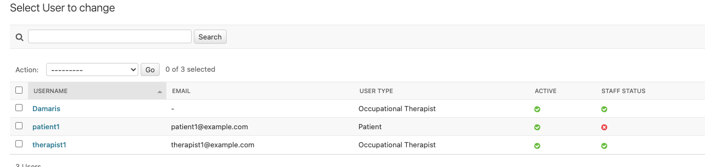
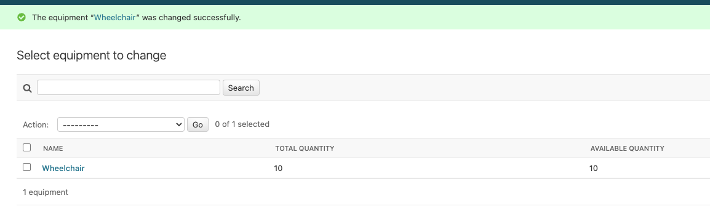

# Quip-Order - Occupational Therapy Management System

## Project Overview

**Quip-Order** is a comprehensive Full-Stack Django web application designed for occupational therapists in NHS/Private Practice s to efficiently manage:

- Equipment ordering and inventory tracking
- Role-based access control (Therapists vs Patients)

### Project Purpose
This system streamlines the workflow for occupational therapists by providing:
- Centralized patient management
- Equipment request and approval workflows
- Real-time caseload monitoring
- Secure, role-based access to sensitive medical information

## Tech Stack
- **Backend:** Python 3.11+, Django 4.2+
- **Database:** PostgreSQL
- **Frontend:** HTML5, CSS3, Vanilla JavaScript
- **Authentication:** Django Allauth with OAuth2
- **Deployment:** Render/Heroku
- **Version Control:** Git with conventional commits

## Setup Instructions

### Prerequisites
- Python 3.11+
- PostgreSQL
- Git

### Installation Steps

#### 1. Clone the Repository
```
git clone https://github.com/yourusername/quip-order.git
cd quip-order
```

#### 2. Create Virtual Environment
```
# Create isolated Python environment
python -m venv venv

# Activate it
# On Mac/Linux:
source venv/bin/activate

# On Windows:
venv\Scripts\activate
```

```
python -m venv venv
source venv/bin/activate  # On Windows: venv\Scripts\activate
pip install django
django-admin startproject quipster .
python manage.py startapp users
python manage.py startapp equipment
python manage.py startapp dashboard
```

### Install Dependencies
```
pip install -r requirements.txt
.env
```

### Project Structure
```
quip-order/
│
├── manage.py                # Django management script
├── requirements.txt         # Python dependencies
├── .env.example             # Environment variables template
├── .gitignore               # Git ignore rules
├── README.md                # This file      
│
└── quiporder/             # Main project configuration
│   │
│   └── __pycache__/       # Tracks database changes
│        └── __init__.cpython-313.pyc
│   ├── __init__.py        # Tells Python this is a package
│   ├── asgi.py            # For async servers 
│   ├── settings.py        # Project settings
│   ├── urls.py            # URL routing
│   └── wsgi.py            # For deploying to web servers
│
└──users/                  # User management app
│  │
   └── migrations/          # Tracks database changes
        └── __init__.py
    │
    ├── __init__.py          # Makes this a Python package
    ├── admin.py             # Register models to appear in admin panel 
    ├── apps.py              # App configuration
    ├── models.py            # Database tables (User, Therapist, Patient)
    ├── tests.py             # Test code goes here
    ├── views.py             # Authentication views

└── equipment/               # Equipment management app
│   ├── models.py            # Equipment, Order models
│   ├── views.py             # CRUD operations
│   ├── forms.py             # Django forms
│   └── tests.py             # Equipment tests
│
└── dashboard/               # Dashboard app
    ├── views.py             # Role-based dashboards
    └── tests.py             # Dashboard tests
   

```

# Manual Testing — Admin CRUD Validation

This checklist validates that each core data model can be read, created, edited, and deleted using the Django admin interface, confirming that the data layer is wired correctly before any API or UI work begins

## Local dev Admin Access

Open terminal in root of your project and run ```python manage.py runserver```

Open the admin panel at:
http://127.0.0.1:8000/admin/

Log in using a staff user account details.

---

This checklist ensures all models are testable via Django admin.

| Step | Model / Action | Data Example | Status  | Notes |
|------|----------------|-------------|----------------|-------|
| 1 | Equipments click Add | Name: Wheelchair, Total: 10, Available: 10 | Tested works as expect | Manual entry |
| 2 | Go to User and Add Occupational Therapist | Username: therapist1, Email: therapist1@example.com, Password: <set>, User type: Occupational Therapist, Is Staff | Tested works as expect | Must be staff tologin to admin |
| 3 | Go to TherapistProfile click Add | User: therapist1, License number: L12345, Max caseload: 20 | Tested works as expect | Optional extra fields |
| 4 | click Add Patient | Username: patient1, Email: patient1@example.com, Password: <set>, User type: PATIENT | Tested works as expect | |
| 5 | PatientProfile click Add | User: patient1, Assigned therapist: therapist1, Medical record: MR001, Status: Active | Tested works as expect | |
| 6 | EquipmentOrder click Add | Equipment: Wheelchair, Patient: patient1, Quantity: 1, Status: Requested |Tested works as expect | Check list, save and verify |
| 7 | Edit Equipment | Change available_quantity from 10 too 9 | Tested works as expect | Confirm persistence to ensure save works |
| 8 | Edit EquipmentOrder | Change quantity and status | Tested works as expect | Confirm persistence to ensure save works |
| 9 | Delete EquipmentOrder | Remove order | Tested works as expect | Check removal reflects |
| 10 | Delete CustomUser / Profiles | Remove test users | Tested works as expect | Ensure deletion works |

> All saves, edits, and deletions completed without error, this means CRUD functionality is validated. See screenshots verification below

# Manual testing above Verification in screenshots below

 **Visual evidence** of manual testing completed via the Django Admin interface.  
All screenshots are stored in `docs/screenshots_verify_tests/` and demonstrate successful CRUD operations for users, patients, therapists, and equipment.

---

## 1. User Creation (Therapist & Patient)

### 1.1 Therapist User Created
Confirms a therapist user was successfully created in Django Admin.


---

### 1.2 Multiple Users Created
Confirms multiple users (therapist + patient) exist and were saved correctly.



---

## 2. Therapist Setup

### 2.1 Therapist Added
Confirms therapist profile creation and association with a user account.


---

## 3. Patient Setup

### 3.1 Patient Added
Confirms patient user creation.


---

### 3.2 Patient Profile Linked
Confirms patient profile creation and linkage to assigned therapist.


---

## 4. Equipment Management

### 4.1 Equipment Updated
Confirms equipment quantities can be edited and saved correctly.



---

### 4.2 Equipment Deleted
Confirms equipment deletion works as expected.


---

## Summary of Manual testing

All screenshots confirm that:
- Records can be **created**
- Records can be **edited**
- Records can be **deleted**
- Relationships between users, therapists, patients, and equipment function correctly

This validates **manual CRUD testing via Django Admin** for the current implementation.

