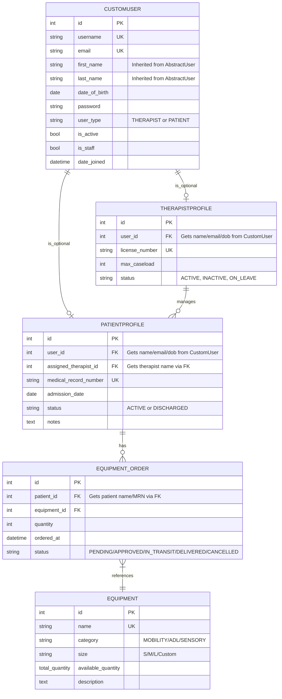
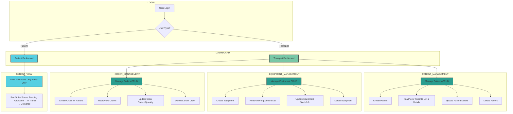

# Quiporder - Occupational Therapy Management System

**Live Site:** [View Deployed Site](#) *(Need to add link when deployed)*

---

## Table of Contents

1. [Project Overview](#project-overview)
   - [Key Functionality](#key-functionality)
   - [Project Purpose](#project-purpose)
   - [Tech Stack](#tech-stack)
   - [System Design Diagrams](#system-design-diagrams)
   - [Role-Based Access](#role-based-access-and-dashboards)

2. [User Stories](#user-stories)
   - [GitHub Projects Board](#agile-planning-and-iteration)

3. [Features](#features) (Need to add all!!!!!!!!!!!!!!!!)
   - [Staff/Admin Features](#staff--admin)
   - [Therapist Features](#therapists)
   - [Patient Features](#patients)

4. [Design](#design) (Need to add all!!!!!!!!!!!!!!!!)
   - [Wireframes](#wireframes) *(If you have them)*
   - [Color Scheme](#color-scheme) *(If you have it)*
   - [Typography](#typography) *(If you have it)*
   - [Database Design (ERD)](#entity-relationship-diagram-erd)
   - [Application Flow](#application-flow--role-based-workflows)

5. [Technologies Used](#technologies-used) (Need to add all!!!!!!!!!!!!!!!!)
   - [Core Technologies](#core-technologies)
   - [Django Packages](#django-packages--extensions)
   - [Development Tools](#development-tools)
   - [Deployment](#deployment--hosting)

6. [Security & Data Protection](#security--data-protection)
   - [Authentication & Authorization](#authentication--authorization)
   - [Account Registration](#account-registration--approval)
   - [Secret Management](#secret-management)
   - [Django Security Features](#django-security-features) (Need to verify i am using these!!!!!!!!!!!!!!!!)

7. [Agile Methodology](#agile-planning-and-iteration)
   - [GitHub Projects](#github-projects-board)
   - [User Testing](#iteration-improvements-from-round-1-observational-user-testing-of-the-admin-panel)

8. [Testing](#testing)
   - [Manual Testing](#manual-testing-admin-crud-validation)
   - [Database Verification](#manual-database-verification---django-admin---postgresql)
   - [Code Validation](#code-validation)
   - [Testing Summary](#testing-summary)

9. [Deployment](#deployment)
   - [Local Setup](#setup-instructions)
   - [Heroku Deployment](#production-deployment-steps)
   - [Troubleshooting](#troubleshooting-deployment)

10. [Future Features](#future-improvements)

11. [Credits & Acknowledgments](#acknowledgement)

---
## Project Overview

### Quiporder

Quiporder is a Full-Stack Django application for occupational therapists in NHS and private practice **and their patients** to manage and track equipment orders.

Staff users (admin) configure the system by creating user accounts, adding therapist and patient profiles, and assigning patients to therapists in the Django Admin.
Therapists then work through a dedicated dashboard to manage their caseload and equipment orders, while patients use a separate dashboard to follow their own orders in a read-only view.

Therapists can register patients, manage their caseload, and create or update equipment orders as part of their clinical workflow, while patients can log in to view the orders assigned to them and follow each order’s status (for example: Pending → Approved → In Transit → Delivered) in a read-only view.

Therapist-facing features use **PatientProfile.status** (ACTIVE / DISCHARGED) to represent the patient’s clinical status, and patient-facing views focus on **EquipmentOrder.status** (PENDING / APPROVED / IN_TRANSIT / DELIVERED / CANCELLED) so patients can clearly see where their equipment is in the logistics journey.

</br>

### Key Functionality

- Equipment ordering and inventory tracking.
- Role-based access control (Staff/Admin, Therapists, Patients).

  - Staff Django Admin screens (restricted to staff users and superusers via Django’s built-in permissions) for:
  - Creating and managing CustomUser accounts.
  - Creating and updating TherapistProfile and PatientProfile.
  - Assigning therapists to patients so they appear correctly in front-end therapist dashboards.
  - Managing equipment and equipment orders with full CRUD capability.
  - Reviewing audit trails via **Status Histories** (e.g. `/admin/equipment/equipmentorderstatushistory/`), showing when order statuses changed and by whom.

- Therapist dashboards for day-to-day CRUD on equipment orders and caseload, using patients that staff have already set up and assigned.
- Patient dashboards for secure, read-only tracking of their own orders and statuses.

</br>

### Project Purpose

**The system is designed to:**

- Provide centralized management of staff, therapists, patients, and equipment orders, with staff/admin configuring users, profiles, and therapist–patient relationships in Django Admin.
- Support request, approval, and fulfilment workflows for equipment, including clear order statuses visible to both therapists and patients.
- Give therapists real-time visibility of their caseload and order status via a dedicated therapist dashboard.
- Provide patients with a simple, secure view of their own orders only, including the logistics status for each order, without exposing any other patients or internal admin data.

</br>

### Tech Stack

- **Backend:** Python 3.13+, Django 5.2.8
- **Database:** PostgreSQL 14+
- **Frontend:** HTML5, CSS3, JavaScript
- **Authentication:** Django Allauth with OAuth2 and role-based access control
- **Config & Secrets:** python-decouple + `.env`
- **Deployment targets:** Render / Heroku
- **Version control:** Git (conventional commits)

</br>

### System Design Diagrams


<details>
  <summary><strong>Entity Relationship Diagram (ERD)</strong></summary>

  <p>Source file: <code>docs/software_architecture_diagrams/erd.md</code></p>


</details>

The ERD shows CustomUser, PatientProfile, TherapistProfile, Equipment, and EquipmentOrder relationships. 


<details> <summary><strong>Application Flow & Role-based Workflows</strong></summary> <p>Source file: <code>docs/software_architecture_diagrams/flow-horizontal-view.md</code></p>


</details

The flow diagram documents therapist vs patient journeys, including dashboards and CRUD vs read-only behaviour.


### Role-Based Access and Dashboards

This project implements role-based login and separated access as required in LO3.

- **Staff / Admin**
  - Use Django Admin with staff/superuser permissions.
  - Create and manage all user accounts (therapists and patients), including:
    - Creating CustomUser records.
    - Creating and updating TherapistProfile and PatientProfile.
    - Assigning patients to therapists.
  - Perform full CRUD on equipment and equipment orders (including correcting data and bulk administration).
  - View audit trails such as **EquipmentOrderStatusHistory** in the admin (e.g. `/admin/equipment/equipmentorderstatushistory/`) to see when order statuses changed and by whom.
  - Can grant or remove staff permissions for other users.
  - If staff users do not create users, profiles, and therapist assignments, those patients and therapists will not appear in the therapist dashboard dropdowns or other front-end views.

- **Therapists**
  - Log in via Django Allauth.
  - Access the **Therapist Dashboard** (`/equipment/dashboard/`) which shows:
    - Top-level metrics (Equipment Items, Total Orders, Pending Orders, Active Patients).
    - Navigation links to:
      - Dashboard: `/equipment/dashboard/`
      - Equipment list: `/equipment/list/`
      - Create order: `/equipment/order/create/`
    - A “Recent Orders” table with quick **Edit** and **Delete** actions for the therapist’s last 10 orders.
  - Can:
    - View equipment inventory summary in the front end.
    - Create new orders for any patient that has been set up and assigned by staff.
    - Edit or delete their existing equipment orders.
  - For detailed equipment CRUD (add/edit/delete equipment definitions) they are directed to the Django Admin via the “Go to Admin Panel” link, which only works for staff users.

- **Patients**
  - Log in via Django Allauth.
  - Access the **Patient Dashboard** (`/equipment/patient/dashboard/`), which shows:
    - Navigation: “Quiporder” home and “My Orders”.
    - A “My Equipment Orders” table listing:
      - Equipment name.
      - Quantity.
      - Current status (e.g. Pending, Approved, In Transit, Delivered, Cancelled).
      - Notes (e.g. “Changed quantity to 3 on 3rd @ 19:20”).
      - Ordered date.
  - Can only **view** their own orders; they cannot create, edit, or delete any equipment or orders.


### Agile Planning and Iteration

Quiporder is planned and tracked using a GitHub Projects kanban board:

##### User Stories:

The user stories used for planning and development of Quiporder are documented below. All user stories were tracked and managed using GitHub Projects.


- **GitHub Projects board:** https://github.com/users/Alumsdesigns/projects/4/views/1

GitHub Projects was utilized for planning this website.
I created and track User Stories.
One week was spent on project planning, including the first mentor meeting where we planned the project timeline. The initial "sprint" took two and I ran each milestone two weeks at a time.

**This board was used to:**

- Capture Epics, User Stories, and Tasks aligned to the project goals.
- Track work across columns such as Backlog, In Progress, In Review, and Done.
- Document iteration rounds, including observational usability testing feedback and subsequent improvements (e.g. admin superuser visibility, clearer dropdown labels, and dashboard refinements) and unexpected bugs and improvements that were identified during testing.

<details>
<summary><strong>Image of project board in action</strong></summary>


</details>


### Project Structure

```
quiporder/
│     
└── docs/            
|
└── equipment/  
│   ├── __pycache__
│   ├──  migrations/  
│   ├── __init__.py         
|   ├── admin.py
|   |── apps.py
│   ├── models.py            
│   ├── tests.py             
│   ├── urls.py            
│   └── views.py            
│
└── quiporder/            
│   ├──  __pycache__/       
│   ├── __init__.py        
│   ├── asgi.py            
│   ├── settings.py        
│   ├── urls.py            
│   └── wsgi.py            
│
└──static/                 
|   ├── css/
|   ├── images/
|   └── js/
│
└── templates/  
│   ├── account/
|   |     ├── login.html
|   |     └── signup_closed.html
|   ├── equipment/
|   |     ├── equipment_list.html
|   |     ├── order_confirm_delete.html
|   |     ├── order_form.html
|   |     ├── patient_dashboard.html
|   |     └── therapist_dashboard.html
|   |    
│   ├──  base.html  
│   └──  home.html        
│
└──users/                  
|  ├──  __pycache__/ 
|  ├──  migrations/        
|  ├── __init__.py          
|  ├── admin.py             
|  ├── apps.py              
|  ├── models.py            
|  ├── tests.py             
|  └── views.py             
│
├── .gitignore               
├── manage.py               
├── README.md              
├── requirements.txt      
└── .env                     
```

</br> 

## Testing

### Manual Testing, Admin CRUD Validation

This checklist validates that each core data model can be read, created, edited, and deleted using the Django admin interface, confirming that the data layer is wired correctly before any API or UI work begins

### Local dev Admin Access

Open terminal in root of your project and run 
```python manage.py runserver```

Open the admin panel at:
http://127.0.0.1:8000/admin/

Log in using a staff user account details provided by admin.

___


### This checklist ensures all models are testable via Django admin

| Step | Model / Action | Data Example | Status  | Notes |
|------|----------------|-------------|----------------|-------|
| 1 | Equipments click Add | Name: Wheelchair, Total: 10, Available: 10 | Tested works as expect | Manual entry |
| 2 | Go to User and Add Occupational Therapist | Username: therapist1, Email: therapist1@example.com, Password: <set>, User type: Occupational Therapist, Is Staff | Tested works as expect | Must be staff tologin to admin |
| 3 | Go to TherapistProfile click Add | User: therapist1, License number: L12345, Max caseload: 20 | Tested works as expect | Optional extra fields |
| 4 | click Add Patient | Username: patient1, Email: patient1@example.com, Password: <set>, User type: PATIENT | Tested works as expect | |
| 5 | PatientProfile click Add | User: patient1, Assigned therapist: therapist1, Medical record: MR001, Status: Active | Tested works as expect | |
| 6 | EquipmentOrder click Add | Equipment: Wheelchair, Patient: patient1, Quantity: 1, Status: Requested |Tested works as expect | Check list, save and verify |
| 7 | Edit Equipment | Change available_quantity from 10 too 9 | Tested works as expect | Confirm persistence to ensure save works |
| 8 | Edit EquipmentOrder | Change quantity and status | Tested works as expect | Confirm persistence to ensure save works |
| 9 | Delete EquipmentOrder | Remove order | Tested works as expect | Check removal reflects |
| 10 | Delete CustomUser / Profiles | Remove test users | Tested works as expect | Ensure deletion works |

> All saves, edits, and deletions completed without error, this means CRUD functionality is validated. See screenshots verification below

### Manual testing above Verification in screenshots below

 **Visual evidence** of manual testing completed via the Django Admin interface.  
All screenshots are stored in `docs/screenshots_verify_tests_admin_updates/` and demonstrate successful CRUD operations for users, patients, therapists, and equipment.

---

### 1. User Creation (Therapist & Patient)

#### 1.1 Therapist User Created
Confirms a therapist user was successfully created in Django Admin.


---

#### 1.2 Multiple Users Created
Confirms multiple users (therapist + patient) exist and were saved correctly.


---

### 2. Therapist Setup

#### 2.1 Therapist Added
Confirms therapist profile creation and association with a user account.


---

### 3. Patient Setupjshint static/js/forms.js

#### 3.1 Patient Added
Confirms patient user creation.


---

#### 3.2 Patient Profile Linked
Confirms patient profile creation and linkage to assigned therapist.


---

### 4. Equipment Management

#### 4.1 Equipment Updated
Confirms equipment quantities can be edited and saved correctly.


---

#### 4.2 Equipment Deleted
Confirms equipment deletion works as expected.


---

### Summary of Manual testing

All screenshots confirm that:
- Records can be **created**
- Records can be **edited**
- Records can be **deleted**
- Relationships between users, therapists, patients, and equipment function correctly

This validates **manual CRUD testing via Django Admin** for the current implementation.


### Manual Database Verification - Django Admin -> PostgreSQL
**Purpose**

This section documents how to verify that data created via the Django Admin UI is persisted correctly in PostgreSQL, and that foreign key relationships are functioning as designed.
To verify that the data created via Django Admin UI exists in PostgreSQL

<details>

This validation confirms that:

- Admin UI inputs are saved to the database

- Migrations are correctly applied

- Relationships between users, profiles, and equipment are intact

- The system behaves correctly beyond the UI abstraction

1. Prerequisites:

- PostgreSQL running

- Django migrations applied

- Test data created via Django Admin UI

- Open terminal in VS Code 

2. Connect to PostgreSQL run below command in the terminal:

```psql -d quiporder```

3. List the tables to inspect existing tables:

```\dt```

Expected tables include:

- users_customuser

- users_patientprofile

- users_therapistprofile

- equipment_equipment

- equipment_equipmentorder


4. Verify the table contents:

```
SELECT * FROM users_patientprofile;
SELECT * FROM users_therapistprofile;
SELECT * FROM equipment_equipment;
SELECT * FROM equipment_equipmentorder;
```

5. Filtering Records Safely
 *Incorrect Assumption, Common Pitfal:*
```SELECT * FROM users_patientprofile WHERE user_id = 1;```


This may return 0 rows, even though the patient exists.

*Why?*

Django Admin does not display database primary keys

id = 1 is typically the first created user, often a superuser or admin

The patient user likely has a different id


 Filter for specific records (example for patient1):

Tip: The id column is usually the primary key; use it to reference specific records for further queries.


6. Filter by ID or name

By ID:
```
SELECT * 
FROM users_patientprofile
WHERE id = 1;
```

**To filter by username see 7 & 8 below**


7. Check the table columnsand inspect the table structure

Always inspect the schema before querying:

Run:
```\d users_patientprofile```

Key insight:

user_id is a foreign key referencing users_customuser(id)

Human-readable fields (username, email) are not stored here

The important thing: there’s a user_id column, which references the CustomUser table

8. Authoritative Verification Using JOINs to view the username

You can join users_patientprofile with users_customuser to see patient1:

Correct Way to Verify a Patient Profile:

```
SELECT p.id AS patient_id,
       u.username,
       p.medical_record_number,
       p.status,
       p.admission_date
FROM users_patientprofile p
JOIN users_customuser u ON p.user_id = u.id
WHERE u.username = 'patient1';
```

Why this works:

Filters using a human identifier

PostgreSQL resolves the correct user_id internally

Confirms both persistence and FK integrity

9. Verify Therapist Profiles

```
SELECT t.id AS therapist_profile_id,
       u.username,
       t.license_number
FROM users_therapistprofile t
JOIN users_customuser u ON t.user_id = u.id;

```

10. Verify Equipment Records

```
SELECT id, name, total_quantity, available_quantity
FROM equipment_equipment;
```

next look at updating with size so will be

```
SELECT id, name, category, size, total_quantity, available_quantity
FROM equipment_equipment;
```

11. Verify Equipment Orders

```
SELECT eo.id,
       e.name AS equipment,
       u.username AS patient,
       eo.quantity,
       eo.status
FROM equipment_equipmentorder eo
JOIN equipment_equipment e ON eo.equipment_id = e.id
JOIN users_customuser u ON eo.patient_id = u.id;
```

**Learnings**

When I tried to verify by ID, I assumed if I knew the user_id (from the UI), I could also filter:

```SELECT * FROM users_patientprofile WHERE user_id = 1;```

I initially assumed should return the patient profile for patient1. However it returned :
0 rows. This is because user_id = 1 is not the user ID for patient1.
In Django the admin UI does NOT show the database primary key

The first user created is often a superuser or a staff/admin account

So id = 1 is very commonly the admin user, not the patient1 user I created for example.

That means:

users_customuser.id = 1  → admin
users_customuser.id = X  → patient1 (X is some other number)


My users_patientprofile row correctly exists, but it is linked to:

users_patientprofile.user_id = X


not 1.

**Why the JOIN query worked to find my users_patientprofile.user_id**

However when I ran the below json query to filter by username:
```
SELECT p.id AS patient_id,
       u.username,
       p.medical_record_number,
       p.status,
       p.admission_date
FROM users_patientprofile p
JOIN users_customuser u ON p.user_id = u.id
WHERE u.username = 'patient1';
```

This query is correct and authoritative. 

It worked because:

I filtered by a real human identifier (username).

PostgreSQL then resolved the correct user_id internally.

This confirms:

- The admin UI entry is persisted.

- The foreign key relationship is correct.

- The table data is real and queryable.

- So the system is working as designed.

**How to reliably find the correct user_id**

Always do this first

```
SELECT id, username, email, user_type
FROM users_customuser
ORDER BY id;
```
You will see something like:

 id |  username  |         email          | user_type 
----+------------+------------------------+-----------
  1 | Damaris    |                        | THERAPIST
  4 | therapist1 | therapist1@example.com | THERAPIST
  5 | patient1   | patient1@example.com   | PATIENT
(3 rows)

Now you know:

```patient1.user_id = 5```

Then this will work:
```SELECT * FROM users_patientprofile WHERE user_id = 5;```

The 
```SELECT p.id AS patient_profile_id,
       u.username,
       p.medical_record_number,
       p.status,
       p.admission_date
FROM users_patientprofile p
JOIN users_customuser u ON p.user_id = u.id;
```

</details>


</br> 

**Key Takeaways**

<details>

Django Admin often stores user info in CustomUser. Related models (like PatientProfile) reference it via foreign key.

Don’t assume the username is a column in the profile table.

Use ```\d table_name``` example ```\d users_patientprofile``` to inspect columns anytime.

Joins are necessary to see human-readable fields like username or email.


Django Admin UI does not display database primary keys.

Profile tables reference users_customuser via foreign keys.

Always join profile tables to users_customuser to verify human-readable fields.

If a direct WHERE user_id = X query returns no rows, verify the correct user ID first.

</details>

</br>

**See screenshots of commands executed:**
The screenshots below demonstrate direct PostgreSQL verification of data created via the Django Admin interface. They show successful execution of psql commands to inspect schemas, query tables, and validate foreign key relationships between CustomUser, profile, and equipment-related models. This confirms that Admin UI actions are correctly persisted to PostgreSQL, migrations are applied as intended, and relational integrity is enforced at the database level.


**Summary**

What screenshots proves:

- Admin UI input is being written to PostgreSQL

- Migrations are applied correctly

- Foreign key relationships are intact

- Your CRUD setup is working end-to-end


### Iteration improvements from round 1 Observational User Testing of the admin panel

#### Testing Context

Three anonymous users (two occupational therapists and one patient) were asked to complete the manual UI testing flow using a pre-configured system.
Users were observed interacting with:

1. Patient profiles

2. Therapist profiles

3. Equipment ordering workflows

Post-session feedback was collected through guided questions, focusing on usability, clarity, and workflow efficiency.

#### Key Observations & Improvements

**1. Enhanced Human-Readable Data in ERD:**

Previous issue: Some tables (e.g., EquipmentOrder) lacked direct references to patient or therapist information, which required multiple lookups and could introduce inconsistencies if names or MRNs changed.

**Improvement:**

- All CustomUser data (first_name, last_name, DOB, email) is stored once in the CustomUser table.

- PatientProfile and TherapistProfile reference CustomUser via foreign keys.

- Names, DOB, and email are derived via FK rather than stored redundantly.

**Reasoning:**

This follows DRY principles (Don’t Repeat Yourself), avoids duplicated facts, and ensures consistency.

Any updates to a user’s name or email automatically propagate across all related profiles and orders.

**2. Equipment & Order Normalization:**
Previous issue: Equipment attributes like size and category were unclear or conflated.

**Improvement:**

- Added size field to Equipment (Small / Medium / Large / Custom) separate from category (Mobility / ADL / Sensory).

- EquipmentOrder references PatientProfile via FK instead of storing patient names or MRNs.

**Reasoning:**

Keeps single source of truth for patient details.

Supports reporting and analytics without risk of inconsistent or outdated data.

**3. Status Fields Clarified:**

PatientProfile.status: ACTIVE / DISCHARGED, reflects clinical workflow.

EquipmentOrder.status: PENDING / APPROVED / IN_TRANSIT / DELIVERED / CANCELLED, reflects logistics workflow.

**Reasoning:**

- Clear separation of concerns avoids confusion between clinical status and equipment workflow.

- Supports KISS principle (Keep It Simple, Stupid) by keeping workflows explicit and easy to track.

**4. Assigned Therapist via FK:**

Previous issue: Some systems store therapist name directly on PatientProfile.

**Improvements:**

- Store assigned_therapist_id FK to TherapistProfile instead of the therapist name.

- Display names derived dynamically through FK in UI/API.

**Reasoning:**

- Avoids duplication and errors if therapist name changes.

- Ensures SOLID principle (Single Responsibility) — PatientProfile tracks assignment, not therapist identity.

**5. General Observational Feedback Incorporated:**

**Users appreciated:**

- Easier reading of patient and therapist details through consistent naming display.

- Equipment details being separated into category and size for clarity.

**Users requested:**

Improved admin interface to display derived names and email directly for search and filtering implemented in admin refinements.


**Observations**

 While the underlying data model and database relationships fully support Quiporder’s functional requirements at this stage, further UI refinements are required to align the user interface with the intended therapist and patient workflows outlined in the flow diagram below:


*Improvements Implemented & Identified*

Custom role-based dashboards should be introduced to complement or replace Django Admin for core CRUD operations in future iterations. These changes would improve usability, enforce clearer role separation, and ensure the interface accurately reflects the system’s real capabilities.

**1.** In particular keeping admin panel for staff level access only with CRUD functionality and the ability to update

**2.** And creating a UI for both Patient and Occupational Terapist needs with relevant Role Baed Access
Ui 
   - **a)** Patient  Dashboard  -> login -> Read view only orders assigned to the patient on the dashboard if such exist
- **b)** Terapist Dashboard -> Login -> CRUD functionality, create orders, view orders, update/edit orders and delete orders 


</br>

### Testing Updates after anonymous observational usability testing 

**Subjects: 5 users - 3 therapist and 2 users
Date:  20-12-2025**

The request was for a view to see which user had superuser permissions, this was added as per below

##### **BEFORE Old Code:**
```
Username | First | Last | Email | DOB | Role | Active | Staff
---------|-------|------|-------|-----|------|--------|------
admin    | Admin | User | ...   | ... |      | ✓      | ✓     ← Blank! Confusing!
drjones  | Dr.   | Jones| ...   | ... | THERAPIST | ✓ | ☐
patient1 | John  | Doe  | ...   | ... | PATIENT   | ✓ | ☐
```

##### **AFTER view with Updates:**
```
Username | First | Last | Email | DOB | Role                      | Active | Staff | Superuser
---------|-------|------|-------|-----|---------------------------|--------|-------|----------
admin    | Admin | User | ...   | ... | System Administrator      | ✓      | ✓     | ✓
drjones  | Dr.   | Jones| ...   | ... | Occupational Therapist    | ✓      | ☐     | ☐
patient1 | John  | Doe  | ...   | ... | Patient 
```

### Code Validation

<details>

#### Python (PEP8)

Validated using flake8:
```
flake8 equipment/ users/ quiporder/ --exclude=migrations,__pycache__ --max-line-length=120 --ignore=E501,W503,W504
```

**Configuration:**
- Max line length: 120 characters
- Ignored: E501 (line too long), W503/W504 (line break style - both valid)

### Errors found below:
```
flake8 equipment/ users/ quiporder/ --exclude=migrations,__pycache__ --max-line-length=120 --ignore=E501,W503
equipment/admin.py:22:1: E302 expected 2 blank lines, found 1
equipment/admin.py:46:1: E302 expected 2 blank lines, found 1
equipment/admin.py:49:1: W293 blank line contains whitespace
equipment/admin.py:52:1: W293 blank line contains whitespace
equipment/admin.py:62:1: W293 blank line contains whitespace
equipment/admin.py:74:1: W293 blank line contains whitespace
equipment/admin.py:78:1: W293 blank line contains whitespace
equipment/admin.py:86:24: W291 trailing whitespace
equipment/admin.py:88:1: E302 expected 2 blank lines, found 1
equipment/admin.py:92:1: W293 blank line contains whitespace
equipment/admin.py:102:28: W291 trailing whitespace
equipment/admin.py:103:21: W291 trailing whitespace
equipment/admin.py:104:20: W291 trailing whitespace
equipment/admin.py:105:18: W291 trailing whitespace
equipment/admin.py:106:24: W291 trailing whitespace
equipment/admin.py:107:22: W291 trailing whitespace
equipment/admin.py:111:18: W291 trailing whitespace
equipment/admin.py:113:22: W291 trailing whitespace
equipment/admin.py:117:35: W291 trailing whitespace
equipment/admin.py:118:37: W291 trailing whitespace
equipment/admin.py:119:36: W291 trailing whitespace
equipment/admin.py:132:34: W291 trailing whitespace
equipment/admin.py:134:10: E121 continuation line under-indented for hanging indent
equipment/admin.py:147:1: W293 blank line contains whitespace
equipment/admin.py:151:1: W293 blank line contains whitespace
equipment/admin.py:155:1: W293 blank line contains whitespace
equipment/admin.py:158:1: W293 blank line contains whitespace
equipment/admin.py:162:5: E303 too many blank lines (2)
equipment/admin.py:165:1: W293 blank line contains whitespace
equipment/admin.py:169:1: W293 blank line contains whitespace
equipment/admin.py:181:52: W291 trailing whitespace
equipment/admin.py:183:1: W293 blank line contains whitespace
equipment/admin.py:185:5: E303 too many blank lines (2)
equipment/admin.py:191:5: E303 too many blank lines (2)
equipment/admin.py:202:1: W293 blank line contains whitespace
equipment/admin.py:207:1: W293 blank line contains whitespace
equipment/admin.py:211:5: E303 too many blank lines (2)
equipment/admin.py:214:1: W293 blank line contains whitespace
equipment/admin.py:220:1: W293 blank line contains whitespace
equipment/admin.py:224:1: W293 blank line contains whitespace
equipment/admin.py:252:34: W291 trailing whitespace
equipment/admin.py:254:32: W291 trailing whitespace
equipment/admin.py:257:9: E123 closing bracket does not match indentation of opening bracket's line
equipment/admin.py:271:1: W293 blank line contains whitespace
equipment/admin.py:277:1: W293 blank line contains whitespace
equipment/admin.py:280:1: W293 blank line contains whitespace
equipment/admin.py:282:1: W293 blank line contains whitespace
equipment/admin.py:286:1: W293 blank line contains whitespace
equipment/admin.py:288:1: W293 blank line contains whitespace
equipment/admin.py:290:1: W293 blank line contains whitespace
equipment/models.py:69:1: W293 blank line contains whitespace
equipment/models.py:103:36: W291 trailing whitespace
equipment/models.py:104:48: W291 trailing whitespace
equipment/models.py:243:13: E303 too many blank lines (2)
equipment/models.py:245:46: W291 trailing whitespace
equipment/models.py:313:1: W293 blank line contains whitespace
equipment/models.py:316:1: W293 blank line contains whitespace
equipment/models.py:320:1: W293 blank line contains whitespace
equipment/models.py:325:1: W293 blank line contains whitespace
equipment/models.py:331:1: W293 blank line contains whitespace
equipment/models.py:349:1: W293 blank line contains whitespace
equipment/models.py:367:1: W293 blank line contains whitespace
equipment/models.py:373:1: W293 blank line contains whitespace
equipment/models.py:412:1: W293 blank line contains whitespace
equipment/models.py:414:1: W293 blank line contains whitespace
equipment/models.py:423:1: W293 blank line contains whitespace
equipment/tests.py:1:1: F401 'django.test.TestCase' imported but unused
equipment/urls.py:15:2: W292 no newline at end of file
equipment/views.py:23:1: W293 blank line contains whitespace
equipment/views.py:25:1: W293 blank line contains whitespace
equipment/views.py:34:1: W293 blank line contains whitespace
equipment/views.py:42:1: W293 blank line contains whitespace
equipment/views.py:50:1: W293 blank line contains whitespace
equipment/views.py:54:1: W293 blank line contains whitespace
equipment/views.py:62:1: W293 blank line contains whitespace
equipment/views.py:70:1: W293 blank line contains whitespace
equipment/views.py:77:1: W293 blank line contains whitespace
equipment/views.py:83:5: E722 do not use bare 'except'
equipment/views.py:86:1: W293 blank line contains whitespace
equipment/views.py:94:1: W293 blank line contains whitespace
equipment/views.py:101:1: W293 blank line contains whitespace
equipment/views.py:110:1: W293 blank line contains whitespace
equipment/views.py:117:1: W293 blank line contains whitespace
equipment/views.py:123:1: W293 blank line contains whitespace
equipment/views.py:127:1: W293 blank line contains whitespace
equipment/views.py:136:1: W293 blank line contains whitespace
equipment/views.py:148:1: W293 blank line contains whitespace
equipment/views.py:163:1: W293 blank line contains whitespace
equipment/views.py:165:1: W293 blank line contains whitespace
equipment/views.py:171:1: W293 blank line contains whitespace
equipment/views.py:174:1: W293 blank line contains whitespace
equipment/views.py:180:1: W293 blank line contains whitespace
equipment/views.py:188:1: W293 blank line contains whitespace
equipment/views.py:194:1: W293 blank line contains whitespace
equipment/views.py:198:1: W293 blank line contains whitespace
equipment/views.py:202:1: W293 blank line contains whitespace
equipment/views.py:207:1: W293 blank line contains whitespace
equipment/views.py:213:1: W293 blank line contains whitespace
equipment/views.py:222:1: W293 blank line contains whitespace
equipment/views.py:229:1: W293 blank line contains whitespace
equipment/views.py:234:1: W293 blank line contains whitespace
equipment/views.py:241:1: W293 blank line contains whitespace
equipment/views.py:251:1: W293 blank line contains whitespace
equipment/views.py:257:1: W293 blank line contains whitespace
equipment/views.py:260:1: W293 blank line contains whitespace
equipment/views.py:263:1: W293 blank line contains whitespace
equipment/views.py:270:1: W293 blank line contains whitespace
equipment/views.py:278:1: W293 blank line contains whitespace
equipment/views.py:285:1: W293 blank line contains whitespace
equipment/views.py:289:1: W293 blank line contains whitespace
equipment/views.py:293:1: W293 blank line contains whitespace
equipment/views.py:298:1: W293 blank line contains whitespace
equipment/views.py:303:1: W293 blank line contains whitespace
equipment/views.py:305:75: W292 no newline at end of file
quiporder/settings.py:46:1: W293 blank line contains whitespace
quiporder/settings.py:61:52: W291 trailing whitespace
quiporder/settings.py:114:10: E131 continuation line unaligned for hanging indent
quiporder/settings.py:186:1: W391 blank line at end of file
quiporder/urls.py:34:9: E131 continuation line unaligned for hanging indent
quiporder/urls.py:35:28: W291 trailing whitespace
quiporder/urls.py:36:74: W291 trailing whitespace
users/adapters.py:16:1: W293 blank line contains whitespace
users/adapters.py:21:1: W293 blank line contains whitespace
users/adapters.py:25:1: W293 blank line contains whitespace
users/adapters.py:30:1: W293 blank line contains whitespace
users/adapters.py:34:1: W293 blank line contains whitespace
users/adapters.py:40:1: W293 blank line contains whitespace
users/adapters.py:44:1: W293 blank line contains whitespace
users/adapters.py:48:1: W293 blank line contains whitespace
users/adapters.py:52:1: W293 blank line contains whitespace
users/adapters.py:56:1: W293 blank line contains whitespace
users/adapters.py:59:23: W292 no newline at end of file
users/admin.py:16:1: E302 expected 2 blank lines, found 0
users/admin.py:20:1: W293 blank line contains whitespace
users/admin.py:44:14: E124 closing bracket does not match visual indentation
users/admin.py:52:13: E123 closing bracket does not match indentation of opening bracket's line
users/admin.py:69:17: E123 closing bracket does not match indentation of opening bracket's line
users/admin.py:70:9: E124 closing bracket does not match visual indentation
users/admin.py:74:20: W291 trailing whitespace
users/admin.py:75:22: W291 trailing whitespace
users/admin.py:76:21: W291 trailing whitespace
users/admin.py:78:20: W291 trailing whitespace
users/admin.py:79:9: E123 closing bracket does not match indentation of opening bracket's line
users/admin.py:93:1: W293 blank line contains whitespace
users/admin.py:103:16: W291 trailing whitespace
users/admin.py:105:24: W291 trailing whitespace
users/admin.py:107:9: E123 closing bracket does not match indentation of opening bracket's line
users/admin.py:115:1: E302 expected 2 blank lines, found 1
users/admin.py:125:9: E123 closing bracket does not match indentation of opening bracket's line
users/admin.py:136:1: W391 blank line at end of file
users/models.py:14:1: E302 expected 2 blank lines, found 1
users/models.py:21:1: W293 blank line contains whitespace
users/models.py:26:1: W293 blank line contains whitespace
users/models.py:32:1: W293 blank line contains whitespace
users/models.py:73:1: E302 expected 2 blank lines, found 1
users/models.py:101:1: W391 blank line at end of file
users/tests.py:1:1: F401 'django.test.TestCase' imported but unused
```

reduced errors too
```
flake8 equipment/ users/ quiporder/ --exclude=migrations,__pycache__ --max-line-length=120 --ignore=E501,W503
equipment/models.py:65:65: W504 line break after binary operator
equipment/tests.py:1:1: F401 'django.test.TestCase' imported but unused
users/tests.py:1:1: F401 'django.test.TestCase' imported but unused
users/views.py:1:1: F401 'django.shortcuts.render' imported but unused
```
**Final result**
I manual fixed errors while iterating examples below:  **0 errors** - All Python code is PEP8 compliant


---

## HTML (W3C)

All HTML templates validated using W3C Markup Validation Service.

### Validation Tool
- **Service:** W3C Markup Validator
- **URL:** https://validator.w3.org/

### Pages Validated

| Page | URL | Result |
|------|-----|--------|
| Home | `/` |  Pass |
| Login | `/accounts/login/` |  Pass |
| Signup Info | `/accounts/signup` |  Pass |
| Therapist Dashboard | `/equipment/dashboard/` | Pass |
| Patient Dashboard | `/equipment/patient/dashboard/` | Pass |
| Equipment List | `/equipment/list/` | Pass |
| Create Order | `/equipment/order/create/` | Pass |
| Delete Confirmation | `/equipment/order/delete/<id>/` | Pass |

### Validation Process
1. Navigate to page in browser
2. Right-click → View Page Source
3. Copy entire HTML
4. Paste into W3C Validator (Direct Input)
5. Review results

### Results
All pages validated successfully with:
- Semantic HTML5
- Proper DOCTYPE
- Valid attributes
- Accessible markup
- All CSS validated successfully using CSS3 standards.
---

### Overall Testing Summary

### 1. Manual Admin CRUD Testing

- All core models (CustomUser, TherapistProfile, PatientProfile, Equipment, EquipmentOrder) tested via Django Admin for create, read, update, delete.
- Steps and sample data are documented in this README (see Manual Testing section above).
- Screenshots stored under:
  - `docs/screenshots_verify_tests_admin_updates/`
  - `docs/screenshots_verify_tests/` (psql verification)

### 2. Database Verification (PostgreSQL)

- Used `psql` to:
  - List tables (`\dt`) and inspect schemas (`\d table_name`)
  - Verify FK relationships via JOINs between `users_customuser`, `users_patientprofile`, `users_therapistprofile`, `equipment_equipment`, and `equipment_equipmentorder`.
- Example JOIN queries are documented in this README to show how patient and therapist records are resolved via foreign keys.

### 3. Code Quality

- **Python:** flake8 run on `equipment/`, `users/`, `quiporder/` with:
  - `--max-line-length=120`
  - `--exclude=migrations,__pycache__`
  - `--ignore=E501,W503,W504`
- Final status: 0 flake8 errors – Python code is PEP8 compliant.

### 4. Frontend Validation

- **HTML:** all key templates validated via W3C Markup Validation Service.
- **CSS:** validated using W3C Jigsaw CSS validator.


## Testing Summary

All code has been validated and follows industry standards. No critical errors found found at present.

</details>

### Future improvements

- Better Calendar Picker
- When adding patient or therapist profile in username dropdown have the users full name also in parentheses
- Forget password functionality

## Setup Instructions

Quiporder is a Full-Stack Django application for occupational therapists to manage patient equipment orders. Follow these steps to set up the project locally.

---

### Prerequisites

Before you begin, ensure you have the following installed:

- **Python 3.13+** - [Download Python](https://www.python.org/downloads/)
- **PostgreSQL 14+** - [Download PostgreSQL](https://www.postgresql.org/download/)
- **Git** - [Download Git](https://git-scm.com/downloads/)
- **pip** - Python package installer (included with Python)

---

### Installation Steps

#### 1. Clone the Repository
```bash
git clone git@github.com:Alumsdesigns/quiporder.git
cd quiporder
```

Or using HTTPS:
```bash
git clone https://github.com/Alumsdesigns/quiporder.git
cd quiporder
```

---

#### 2. Create Virtual Environment

**On macOS/Linux:**
```bash
python3 -m venv venv
source venv/bin/activate
```

**On Windows:**
```bash
python -m venv venv
venv\Scripts\activate
```

You should see `(venv)` in your terminal prompt indicating the virtual environment is active.

---

#### 3. Install Dependencies
```bash
pip install -r requirements.txt
```

This installs all required Python packages including Django, psycopg2, django-allauth, and python-decouple.

---

---

#### 4. Setup Environment Variables

Create a `.env` file in the project root directory:
```bash
touch .env
```

Add the following to `.env`:
```env
SECRET_KEY=your-generated-secret-key-here
DEBUG=True
ALLOWED_HOSTS=localhost,127.0.0.1

POSTGRES_DB=quiporder
POSTGRES_USER=yourusername. # Must match your Postgres superuser role
POSTGRES_PASSWORD=yourpassword
POSTGRES_HOST=localhost
POSTGRES_PORT=5432
```


Verify environment variables are set in terminal, example run:
```echo #POSTGRES_DB``` you should see quiporder if you do not you can export this in your terminal, its also good practice to set in your .zshrc or check you are not overriding it in zshrc or by running the echo command. To export them direct in the terminal you can run ```POSTGRES_PORT=5432``` check all variavles are set in wth the same ```echo $variable-name``` command in the terminal

**Important:** 
- Replace `your-generated-secret-key-here` with the key from step 6 below
- Replace `yourusername` and `yourpassword` with your PostgreSQL credentials
- **Never commit `.env` to version control** (already in `.gitignore`)

---

#### 5. Generate Secret Key

Django requires a secret key for security. Generate one using:
```bash
python manage.py shell
```

Then in the Python shell:
```python
from django.core.management.utils import get_random_secret_key
print(get_random_secret_key())
exit()
```

**Copy the generated key** - you'll need into your .env file you created in dstep 4.

Exit the shell type ```exit()``` and enter

#### 6. Setup PostgreSQL Database

**Start PostgreSQL:**

**macOS (Homebrew):**
```bash
brew services start postgresql
```

**Linux:**
```bash
sudo service postgresql start
```

**Windows:** PostgreSQL should start automatically, or use pgAdmin.

**Verify Postgres is running:**
```brew services list | grep postgres```
```pg_isready -h localhost -p 5432```

You should see accepting connections on port 5432.


**Next you need to run and create your database:**

```bash
# Login to PostgreSQL Login to PostgreSQL 
psql -U postgres

# Example Connects as role myuser to database mydatabase:
psql -U myuser -d mydatabase


# First Check existing databases:
\l

# Create database
CREATE DATABASE quiporder;

# Verify roles: 
\du


# Create user (optional - use your own credentials)
CREATE USER <enter-a-made-up-username> WITH PASSWORD <'enter-a-password';

# Grant privileges
GRANT ALL PRIVILEGES ON DATABASE quiporder TO yourusername;

# Exit PostgreSQL
\q
```
Update your .env variables with POSTGRES_USER and POSTGRES_PASSWORD with the username and password you chose

---

#### 7. Verify PostgreSQL Connectivity
Before running migrations, confirm Django can connect:
**Using current OS user (default)**
```psql -d quiporder```

 **OR, specify a Postgres user explicitly**
```psql -U <your_postgres_user> -d quiporder```

Should connect without errors.
Optional: check inside psql:
```\l ```   -- list databases
```\dt ```  -- list tables (should be empty initially)
```\q```    -- exit

---

#### 8. Run Database Migrations

Apply database migrations to create all required tables:
```bash
python manage.py makemigrations
python manage.py migrate
```

You should see output confirming migrations were applied.

---

#### 9. Create Django Superuser (Admin)

Create an admin account to access the Django admin panel:
```bash
python manage.py createsuperuser
```

Follow the prompts to set:

**Prompts and answers:**
```
Username
User type (THERAPIST/PATIENT): THERAPIST
Password: ********
Password (again): ********
Superuser created successfully.
```

**Important:** This superuser will have full admin access. Regular therapist and patient accounts should be created through the admin panel after logging in.

---

#### 10. Run Development Server

Start the Django development server:
```bash
python manage.py runserver
```

You should see:
```
Starting development server at http://127.0.0.1:8000/
```

---

#### 11. Access the Application

**Main Site:**
- Visit: http://127.0.0.1:8000/
- You should see the Quiporder home page

**Admin Panel:**
- Visit: http://127.0.0.1:8000/admin/
- Login with superuser credentials from step 8
- Create therapist and patient accounts here

---

#### Optional: Collect Static Files

Only needed if static files aren't loading locally:
```bash
python manage.py collectstatic --noinput
```

---

### Troubleshooting

#### Database Connection Error
```bash
# Verify PostgreSQL is running
pg_isready

# Check database exists
psql -l

# Verify credentials in .env file
```

#### Migration Errors
```bash
# Reset migrations ( WARNING: Data loss!)
python manage.py migrate --run-syncdb
```

#### Module Not Found Error
```bash
# Ensure virtual environment is activated
source venv/bin/activate  # macOS/Linux
venv\Scripts\activate     # Windows

# Reinstall dependencies
pip install -r requirements.txt
```

#### Port Already in Use
```bash
# Use different port
python manage.py runserver 8001
```

or follow the guide at the bottom of 4. Setup Environment Variables above

---

### Next Steps

Once the server is running:

1. **Create User Accounts:**
   - Go to http://127.0.0.1:8000/admin/
   - Add therapist and patient users
   - Set user types and activate accounts

2. **Add Equipment:**
   - Navigate to Equipment in admin panel
   - Add equipment items with quantities

3. **Test Features as Therapist:**
   - Login as therapist
   - Create equipment orders
   - Test CRUD operations

4. **Test Features as Patient:**
   - Login as patient
   - View orders

---

## Deployment

Quiporder is deployed on Heroku, a cloud platform that supports PostgreSQL databases and Python applications.

**Live Site:** [View Deployed Site](#) *(Add your Heroku URL)*


### Prerequisites for Deployment

#### Post-Deployment Checklist
Before deploying, ensure you have


- [ ] A [Heroku account](https://signup.heroku.com/)
- [ ] [Heroku CLI](https://devcenter.heroku.com/articles/heroku-cli) installed
- [ ] Git repository with all code committed
- [ ] `requirements.txt` file up to date
- [ ] `Procfile` in project root
- [ ] Project tested locally

#### **Security:**
- [ ] `DEBUG = False` in production
- [ ] Secret keys not in git repository
- [ ] `.env` file in `.gitignore`
- [ ] `ALLOWED_HOSTS` configured correctly

#### **Database:**
- [ ] Migrations applied on Heroku
- [ ] Superuser created
- [ ] Test data added (if needed)

#### **Static Files:**
- [ ] `collectstatic` run successfully
- [ ] CSS/JS loading correctly
- [ ] Images displaying properly

#### **Functionality:**
- [ ] Login/Logout working as admin, therapist and patient
- [ ] CRUD operations working in admin and for therapists
- [ ] Patient logs i and can view orders only, if there is any
- [ ] Admin panel accessible
- [ ] All pages loading correctly

---

### Production Deployment Steps

For production Heroku, the SECRET_KEY is stored in Config Vars (environment variables) and never committed to the repository.

#### 1. Create Heroku App

**Via Heroku Dashboard:**

1. Login to [Heroku](https://heroku.com/)
2. Click **"New"** → **"Create new app"**
3. Choose a unique app name (e.g., `quiporder-app`)
4. Select your region (Europe or United States)
5. Click **"Create app"**

**Or via Heroku CLI:**
```bash
heroku login
heroku create quiporder-app
```

---

#### 2. Add PostgreSQL Database

**Via Heroku Dashboard:**

1. Go to **Resources** tab
2. In **Add-ons** search bar, type: `postgres`
3. Select **"Heroku Postgres"**
4. Choose plan: **"Hobby Dev - Free"**
5. Click **"Submit Order Form"**

**Or via Heroku CLI:**
```bash
heroku addons:create heroku-postgresql:hobby-dev
```

---

#### 3. Configure Environment Variables

**Via Heroku Dashboard:**

1. Go to **Settings** tab
2. Click **"Reveal Config Vars"**
3. Add the following config vars:

| Key | Value | Notes |
|-----|-------|-------|
| `DATABASE_URL` | *Auto-populated by Heroku Postgres* | Leave as-is |
| `SECRET_KEY` | *Your Django secret key* | Generate new one for production |
| `DEBUG` | `False` | **CRITICAL: Must be False** |
| `ALLOWED_HOSTS` | `quiporder-app.herokuapp.com` | Your Heroku app URL |
| `DISABLE_COLLECTSTATIC` | `1` | Temporary - remove before final deployment |

**Generate Production Secret Key:**
```bash
python manage.py shell
from django.core.management.utils import get_random_secret_key
print(get_random_secret_key())
exit()
```

**Or via Heroku CLI:**
```bash
heroku config:set SECRET_KEY="your-secret-key-here"
heroku config:set DEBUG=False
heroku config:set ALLOWED_HOSTS="quiporder-app.herokuapp.com"
heroku config:set DISABLE_COLLECTSTATIC=1
```

---

#### 4. Update Django Settings

**File: `quiporder/settings.py`**

Ensure these settings are configured for deployment:
```python
import os
import dj_database_url

# SECURITY WARNING: keep the secret key used in production secret!
SECRET_KEY = os.environ.get('SECRET_KEY')

# SECURITY WARNING: don't run with debug turned on in production!
DEBUG = os.environ.get('DEBUG', 'False') == 'True'

ALLOWED_HOSTS = os.environ.get('ALLOWED_HOSTS', 'localhost').split(',')

# Database
DATABASES = {
    'default': dj_database_url.parse(
        os.environ.get('DATABASE_URL'),
        conn_max_age=600
    )
}

# Static files (CSS, JavaScript, Images)
STATIC_URL = '/static/'
STATICFILES_DIRS = [os.path.join(BASE_DIR, 'static')]
STATIC_ROOT = os.path.join(BASE_DIR, 'staticfiles')
```

---

#### 5. Create Procfile

**File: `Procfile`** (in project root, no file extension)
```
web: gunicorn quiporder.wsgi
```

This tells Heroku how to run your application.

---

#### 6. Update Requirements

Ensure `requirements.txt` includes deployment dependencies:
```bash
pip install gunicorn dj-database-url psycopg2-binary
pip freeze > requirements.txt
```

**Verify these are in `requirements.txt`:**
- `gunicorn` - WSGI HTTP Server
- `dj-database-url` - Database URL parser
- `psycopg2-binary` - PostgreSQL adapter

---

#### 7. Commit Changes
Always use conventional commit messages:
```bash
git add .
git commit -m "chore(deploy): configure for Heroku deployment

DEPLOYMENT SETUP:
- Add Procfile for gunicorn
- Update settings for production
- Add deployment dependencies
- Configure environment variables

Refs #deployment"
```
---

#### 8. Deploy to Heroku

**Via Git:**
```bash
# Add Heroku remote
heroku git:remote -a quiporder-app

# Push to Heroku
git push heroku main
```

**Or via Heroku Dashboard:**

1. Go to **Deploy** tab
2. **Deployment method:** Select **"GitHub"**
3. Click **"Connect to GitHub"**
4. Search for repository: `quiporder`
5. Click **"Connect"**
6. **Manual deploy:** Select branch `main`
7. Click **"Deploy Branch"**

---

#### 9. Run Migrations on Heroku
```bash
heroku run python manage.py migrate
```

---

#### 10. Create Superuser on Heroku
```bash
heroku run python manage.py createsuperuser
```

Follow prompts to create admin account.

---

#### 11. Collect Static Files

**Remove `DISABLE_COLLECTSTATIC` config var:**
```bash
heroku config:unset DISABLE_COLLECTSTATIC
```

**Collect static files:**
```bash
heroku run python manage.py collectstatic --noinput
```

---

#### 12. Open Application
```bash
heroku open
```

Or visit: `https://quiporder-app.herokuapp.com`

___

### Updating the Deployed Site

**After making changes locally:**
```bash
# 1. Test locally
python manage.py runserver

# 2. Commit changes
git add .
git commit -m "your commit message"

# 3. Push to GitHub
git push origin main

# 4. Deploy to Heroku
git push heroku main

# 5. Run migrations if needed
heroku run python manage.py migrate
```

**Or enable automatic deploys:**

1. Go to **Deploy** tab on Heroku Dashboard
2. **Automatic deploys:** Click **"Enable Automatic Deploys"**
3. Every push to `main` branch will auto-deploy

---

### Troubleshooting Deployment

#### Application Error (H10)
```bash
# Check logs
heroku logs --tail

# Common causes:
# - Missing Procfile
# - Wrong Procfile format
# - Incorrect WSGI path
```

#### Database Connection Error
```bash
# Verify DATABASE_URL
heroku config:get DATABASE_URL

# Reset database (DATA LOSS!)
heroku pg:reset DATABASE_URL
heroku run python manage.py migrate
```

#### Static Files Not Loading
```bash
# Verify DISABLE_COLLECTSTATIC is unset
heroku config

# Re-collect static files
heroku run python manage.py collectstatic --noinput
```

#### Check Application Status
```bash
# View app info
heroku info

# Check dyno status
heroku ps

# View recent logs
heroku logs --tail
```

---

### Heroku CLI Commands Reference
```bash
# View logs
heroku logs --tail

# Run Django commands
heroku run python manage.py <command>

# Open Python shell
heroku run python manage.py shell

# Restart dyno
heroku restart

# View config vars
heroku config

# Scale dynos
heroku ps:scale web=1
```

---

## Security & Data Protection

### Overview

Quiporder implements comprehensive security measures to protect sensitive patient and healthcare data in compliance with data protection regulations. The system follows Django security best practices and healthcare industry standards.

---

### Authentication & Authorization

#### Role-Based Access Control (RBAC)

**Three-tier access model:**

1. **Staff/Admin Users**
   - Full system access via Django Admin
   - User and profile management (CRUD)
   - Equipment inventory management
   - Audit trail access
   - Permission: `is_staff=True` or `is_superuser=True`

2. **Therapist Users**
   - Therapist dashboard access
   - Equipment order management (CRUD within 24-hour window)
   - View assigned patient records
   - Limited to own orders for edit/delete
   - Permission: `user_type='THERAPIST'` and `is_active=True`

3. **Patient Users**
   - Patient dashboard access (read-only)
   - View own equipment orders only
   - No create/edit/delete permissions
   - Permission: `user_type='PATIENT'` and `is_active=True`

**Enforcement Points:**
- View decorators: `@login_required`
- View-level checks: `if request.user.user_type != 'THERAPIST'`
- Template conditionals: ``
- Admin permissions: Django's built-in `is_staff` and `is_superuser`

---

### Account Registration & Approval

#### Restricted Registration

**Why signup is closed to public registration:**

Quiporder restricts self-registration to maintain data security and ensure only authorized healthcare professionals and verified patients access the system. This design decision addresses several critical requirements:

1. **Healthcare Compliance:**
   - Only verified healthcare professionals should access patient data
   - Patient accounts must be linked to verified medical records
   - Staff must validate user identity before granting access

2. **Data Protection:**
   - Prevents unauthorized access to sensitive medical information
   - Ensures GDPR/HIPAA-style data handling
   - Maintains audit trail of who created each account

3. **Professional Context:**
   - Therapists must have valid licenses (verified by staff)
   - Patients must be assigned to specific therapists
   - Maintains proper clinical relationships

**Account Creation Workflow:**

1. **Staff creates user account** in Django Admin
   - Sets `user_type` (THERAPIST or PATIENT)
   - Sets `is_active=False` initially
   - Generates temporary password

2. **Staff creates corresponding profile:**
   - TherapistProfile (with license number)
   - OR PatientProfile (with medical record number, assigned therapist)

3. **Staff activates account:**
   - Sets `is_active=True`
   - User receives credentials via secure communication

4. **User logs in:**
   - Django Allauth handles authentication
   - Redirected to appropriate dashboard based on `user_type`

**User Communication:**

The signup page (`/accounts/signup/`) displays:
- Explanation of admin-only account creation
- Instructions for new employees to contact HR/admin
- Security rationale (data protection)
- Admin instructions for account creation workflow

This approach demonstrates:
- An understanding of real-world healthcare security needs
- Professional communication with users
- Thoughtful UX design for restricted access
- Compliance-first architecture

---

### Secret Management

#### Security Incident Disclosure

**Timeline:**
- **Dec 29, 2025:** Django `SECRET_KEY` accidentally committed to repository in plaintext
- **Dec 30, 2025:** Issue identified and remediated

**Impact:**
- Exposed key (`django-insecure-1*#%*n...`) was development-only
- No production deployment occurred with exposed key
- No user data or passwords compromised
- Issue caught before public release

**Remediation Actions:**

1. **Immediate Key Rotation**
```python
   # Generated new SECRET_KEY
   python manage.py shell
   >>> from django.core.management.utils import get_random_secret_key
   >>> print(get_random_secret_key())
```

2. **Environment Variable Migration**
   - Moved `SECRET_KEY` from `settings.py` to `.env` file
   - Added `.env` to `.gitignore`
   - Configured `python-decouple` for environment variable management

3. **Settings Update**
```python
   # quiporder/settings.py
   from decouple import config
   
   SECRET_KEY = config('SECRET_KEY')
   DEBUG = config('DEBUG', default=False, cast=bool)
   ALLOWED_HOSTS = config('ALLOWED_HOSTS', default='localhost').split(',')
```

4. **Documentation**
   - Created `.env` template
   - Updated README with setup instructions
   - Added security best practices section

5. **Old Key Invalidated**
   - Previous key no longer in use
   - All environments using new key
   - Git history contains invalid key only

---

#### Current Security Posture

**Local Development:**
```env
# .env (gitignored)
SECRET_KEY=<generated-secret-key>
DEBUG=True
ALLOWED_HOSTS=localhost,127.0.0.1

POSTGRES_DB=quiporder
POSTGRES_USER=<username>
POSTGRES_PASSWORD=<password>
POSTGRES_HOST=localhost
POSTGRES_PORT=5432
```

**Production Deployment (Heroku):**
```bash
# Config Vars (environment variables)
heroku config:set SECRET_KEY="<production-secret-key>"
heroku config:set DEBUG=False
heroku config:set ALLOWED_HOSTS="quiporder-app.herokuapp.com"
heroku config:set DATABASE_URL="<auto-populated>"
```

**Security Checklist:**
- [ ] SECRET_KEY in environment variables (not in code)
- [ ] `.env` file in `.gitignore`
- [ ] DEBUG=False in production
- [ ] ALLOWED_HOSTS configured correctly
- [ ] Database credentials in environment variables
- [ ] No hardcoded passwords in repository

---

### Django Security Features

#### Built-in Protections

1. **CSRF Protection**
   - Django middleware validates CSRF tokens on all POST requests
   - `` in all forms
   - Prevents cross-site request forgery attacks

2. **SQL Injection Prevention**
   - Django ORM uses parameterized queries
   - User input never directly concatenated into SQL
   - Example: `Equipment.objects.filter(id=user_input)` This is Safe

3. **XSS Prevention**
   - Django templates auto-escape HTML by default
   - `{{ variable }}` automatically escapes `<script>` tags
   - Manual escaping: `{{ variable|escape }}`

4. **Password Security**
   - Passwords hashed using PBKDF2 algorithm (default)
   - Salted hashes stored in database
   - Plain text passwords never stored

5. **Clickjacking Protection**
   - `X-Frame-Options: DENY` header
   - Prevents site from being embedded in iframe

6. **HTTPS Enforcement (Production)**
```python
   # settings.py (production)
   SECURE_SSL_REDIRECT = True
   SESSION_COOKIE_SECURE = True
   CSRF_COOKIE_SECURE = True
```

---

### Access Control Implementation

#### View-Level Security

**Decorator-based:**
```python
@login_required
def therapist_dashboard(request):
    if request.user.user_type != 'THERAPIST' and not request.user.is_superuser:
        messages.error(request, 'Access denied. Therapists only.')
        return redirect('home')
    # ... view logic
```

**Template-level:**
```django

    
        <a href="">Create Order</a>
    

```

**Model-level (Ownership):**
```python
# Users can only edit their own orders
if order.created_by != request.user:
    messages.error(request, 'You can only edit your own orders.')
    return redirect('therapist_dashboard')
```

---

## Error Handling

Custom error pages provide user-friendly feedback when issues occur, maintaining brand consistency and accessibility standards.

### Error Pages

| Code | Page | Trigger | Features |
|------|------|---------|----------|
| **403** | Forbidden | Permission denied | Login option, clear explanation |
| **404** | Not Found | Invalid URL | Helpful navigation, typo guidance |
| **405** | Method Not Allowed | Wrong HTTP method | Technical details for developers |
| **500** | Server Error | Application crash | User-friendly message, retry option |

### Design

- **Consistent branding**: Matches dashboard color scheme (#2A9D8F)
- **Accessibility**: WCAG 2.1 AA compliant with ARIA labels and keyboard navigation
- **Responsive**: Mobile-first design with stacked buttons on small screens
- **Actions**: Clear navigation options (Homepage, Login, Go Back)

### Implementation

**Error Handlers** (`quiporder/urls.py`):
```python
handler403 = 'quiporder.views.error_403'
handler404 = 'quiporder.views.error_404'
handler405 = 'quiporder.views.error_405'
handler500 = 'quiporder.views.error_500'
```

**Templates**: `templates/errors/` | **Styles**: `static/css/errors.css`

### Local Testing

Error pages activate when `DEBUG=False`. In development (`DEBUG=True`), Django shows detailed debug pages for troubleshooting.

#### Option 1: Quick Test (Recommended)

1. **Temporarily set in `settings.py`:**
```python
   DEBUG = False
   ALLOWED_HOSTS = ['*']
```

2. **Clear cache and restart:**
```bash
   rm -rf staticfiles/
   find . -type d -name "__pycache__" -exec rm -r {} + 2>/dev/null
   python manage.py collectstatic --noinput
   python manage.py runserver
```
   *These commands clear cached files to ensure CSS updates are visible.*

3. **Test in incognito/private window:**
   - 403: Try accessing `/admin/` without login
   - 404: Visit `/page-does-not-exist/`
   - 405: Rare in browser (works automatically when triggered)
   - 500: Requires server error (test in production)

4. **Revert settings:**
```python
   DEBUG = config('DEBUG', default=True, cast=bool)
   ALLOWED_HOSTS = config('ALLOWED_HOSTS', default='localhost,127.0.0.1').split(',')
```

**Why incognito mode?** Prevents browser from showing cached versions of error pages.

**Why clear staticfiles?** Django caches CSS files; clearing ensures latest styles are loaded.

#### Option 2: Manual Test Views

For more control, create temporary test views in `equipment/views.py`:
```python
from django.core.exceptions import PermissionDenied
from django.http import HttpResponseNotAllowed

def test_403(request):
    raise PermissionDenied("Testing 403")

def test_405(request):
    return HttpResponseNotAllowed(['POST'])

def test_500(request):
    raise Exception("Testing 500")
```

Add URLs in `equipment/urls.py`:
```python
path('test-403/', views.test_403, name='test_403'),
path('test-405/', views.test_405, name='test_405'),
path('test-500/', views.test_500, name='test_500'),
```

Visit (with `DEBUG=False`):
- `http://127.0.0.1:8000/equipment/test-403/`
- `http://127.0.0.1:8000/equipment/test-405/`
- `http://127.0.0.1:8000/equipment/test-500/`

**⚠️ Important:** Remove test views and URLs before production deployment.

### Production Deployment

Error pages work automatically on Heroku:
```bash
heroku config:set DEBUG=False
```

No additional configuration needed. Custom error pages display automatically when errors occur.

---

### Data Protection

#### Audit Trail

**Status History Tracking:**
- Every order status change recorded in `EquipmentOrderStatusHistory`
- Captures: old_status, new_status, changed_by, changed_at
- Immutable records (no edit/delete for non-superusers)
- Accessible to staff via Django Admin

**Soft Delete:**
- Orders marked as deleted (not removed from database)
- `deleted_at` timestamp and `deleted_by` user recorded
- Preserves audit trail and referential integrity
- Allows recovery if needed

#### Database Security

**PostgreSQL Configuration:**
- User accounts with minimum required privileges
- Separate credentials for development and production
- Connection pooling for performance and security
- Encrypted connections in production (Heroku SSL)

**Data Integrity:**
- Foreign key constraints enforce relationships
- NOT NULL constraints on required fields
- Unique constraints on sensitive identifiers (email, MRN)
- Check constraints on inventory (available ≤ total)

---

### Production Security

#### Heroku Deployment

**Environment Isolation:**
```python
# settings.py
import os

# Never True in production
DEBUG = os.environ.get('DEBUG', 'False') == 'True'

# Only allowed domains
ALLOWED_HOSTS = os.environ.get('ALLOWED_HOSTS', '').split(',')
```

**Secret Management:**
- All secrets in Heroku Config Vars
- Never committed to git
- Rotated regularly
- Different keys for development and production

**HTTPS Enforcement:**
```python
# Production settings
SECURE_SSL_REDIRECT = True
SECURE_PROXY_SSL_HEADER = ('HTTP_X_FORWARDED_PROTO', 'https')
SESSION_COOKIE_SECURE = True
CSRF_COOKIE_SECURE = True
```

---

### Best Practices Followed

#### Development
- Virtual environment for dependency isolation
- `.gitignore` includes `.env`, `__pycache__`, `db.sqlite3`
- Requirements.txt for reproducible builds
- Conventional commits for audit trail

#### Code
- PEP8 compliance (flake8 validation)
- No hardcoded credentials
- Parameterized database queries (ORM)
- Input validation on all forms
- Error handling with user-friendly messages

#### Deployment
- DEBUG=False in production
- ALLOWED_HOSTS explicitly configured
- Static files served via Whitenoise/CDN
- Database backups (Heroku automated)
- Logging configured for monitoring

---

### Future Security Enhancements

**Planned for future iterations:**

1. **Two-Factor Authentication (2FA)**
   - SMS or TOTP for therapist accounts
   - Extra security for accessing patient data

2. **Session Management**
   - Automatic logout after inactivity
   - Session expiration for shared computers
   - "Remember me" option with secure tokens

3. **Password Policies**
   - Minimum complexity requirements
   - Password expiration (e.g., 90 days)
   - Password history (prevent reuse)

4. **API Rate Limiting**
   - Prevent brute force login attempts
   - Throttle API requests

5. **Security Logging**
   - Log all authentication attempts
   - Log permission denied events
   - Alert on suspicious activity

6. **Data Encryption at Rest**
   - Encrypt sensitive fields (notes, MRN)
   - Database-level encryption

---

### Note for Assessors

This security implementation demonstrates:

- **LO3 (Authentication & Authorization):** Role-based login with restricted access
- **LO6.4 (Security):** DEBUG=False, secrets in environment variables, no passwords in git
- **Industry Best Practices:** CSRF protection, password hashing, input validation
- **Real-World Application:** Healthcare-appropriate security model
- **Transparency:** Security incident properly disclosed and remediated
- **Compliance-Ready:** Audit trails, soft deletes, access controls

All security measures follow Django documentation and OWASP recommendations.

---

## License
Educational project for Code Institute Portfolio Project 4.

---

## Acknowledgement
I would like to thank my mentor, Brian Macharia, for providing very good advice, tips and feedback, as well as excellent resources that aided greatly in organising and implementing this project.