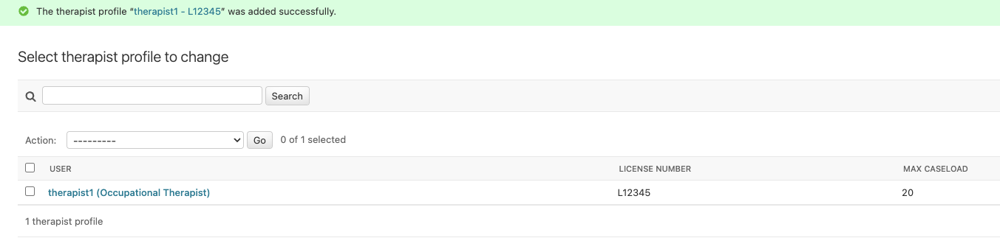
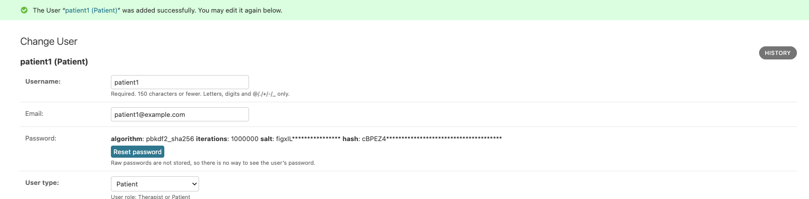
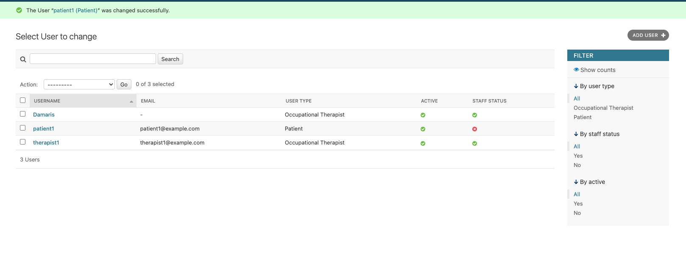
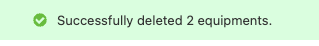
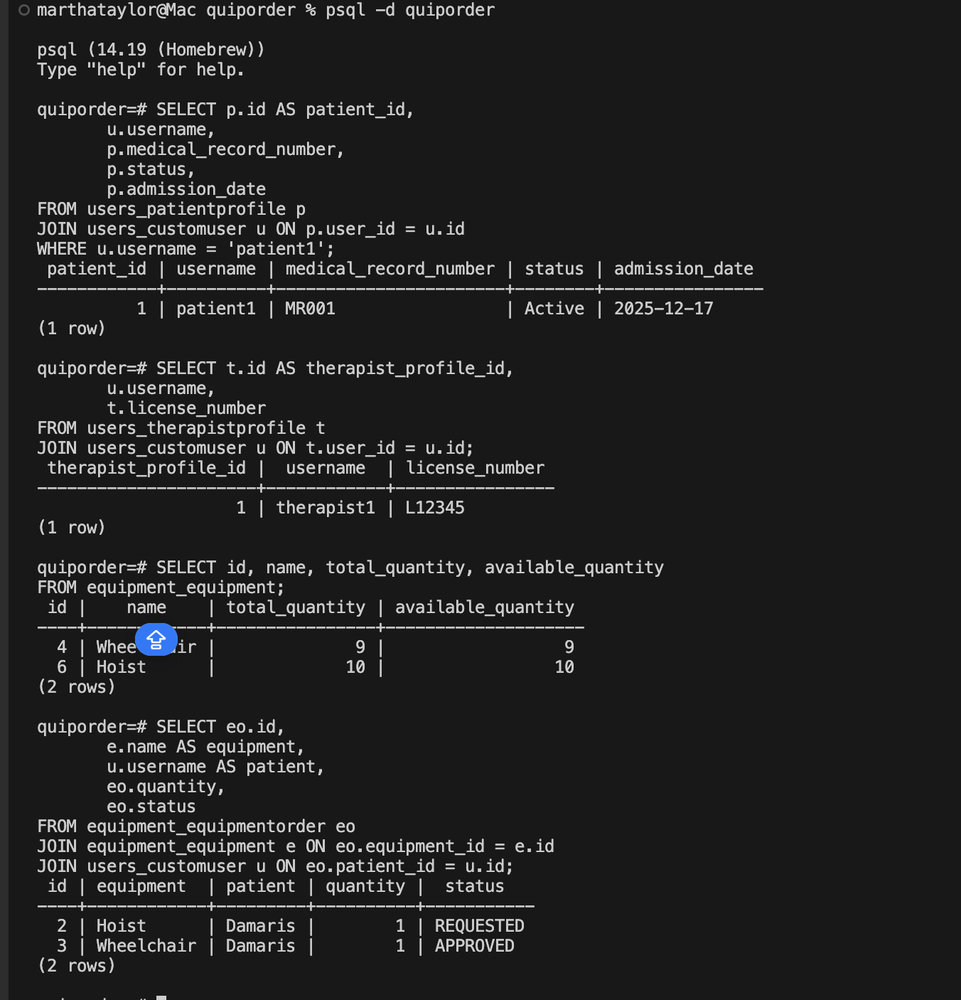
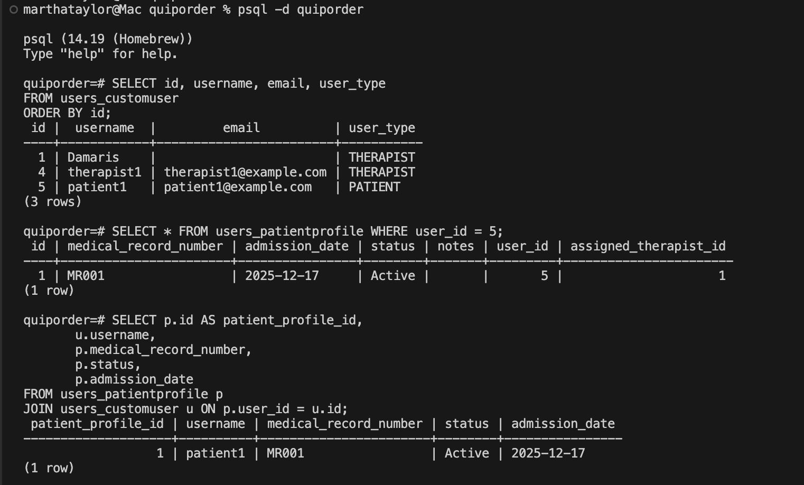
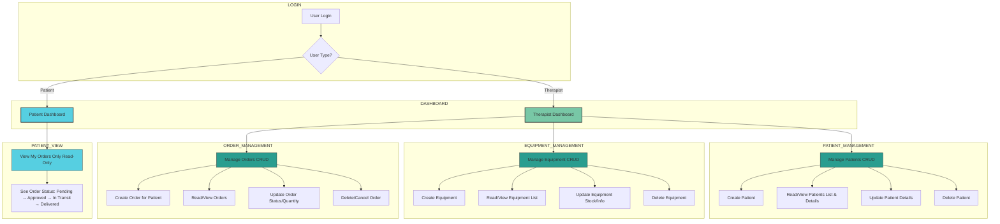
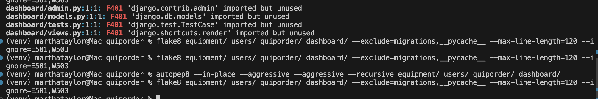
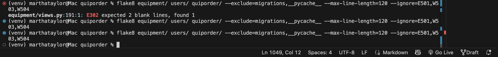

# Quip-Order - Occupational Therapy Management System

## Project Overview

**Quip-Order** is a comprehensive Full-Stack Django web application designed for occupational therapists in NHS/Private Practices to efficiently manage:

- Equipment ordering and inventory tracking
- Role-based access control (Therapists vs Patients)

### Project Purpose
This system streamlines the workflow for occupational therapists by providing:
- Centralized patient management
- Equipment request and approval workflows
- Real-time caseload monitoring
- Secure, role-based access to sensitive medical information

## Tech Stack

### Backend
- **Django 5.2.8** - Web framework
- **PostgreSQL** - Database
- **python-decouple** - Environment variable management
- **django-allauth** - Authentication

### Frontend
- **HTML5** - Structure
- **CSS3** - Styling (custom color scheme)
- **JavaScript** - Interactivity

- **Backend:** Python 3.13+, Django 4.2+
- **PostgreSQL 14**
- **Database:** PostgreSQL
- **Frontend:** HTML5, CSS3, JavaScript
- **Authentication:** Django Allauth with OAuth2
- **Deployment:** Render/Heroku
- **Version Control:** Git with conventional commits

## Setup Instructions

### Prerequisites
- Python 3.13+
- PostgreSQL 14+
- `python-decouple` for environment variable management
-  Git

### Installation Steps

#### 1. Clone the Repository
```
git clone https://github.com/yourusername/quip-order.git
cd quip-order
```

#### 2. Create Virtual Environment
```python -m venv venv```

# Activate itOn Mac/Linux:
```
python -m venv venv
source venv/bin/activate  
```

### Install Dependencies
```
pip3 install -r requirements.txt
```

### 5. Setup PostgreSQL Database

### Login to PostgreSQL
```psql -U postgres```

### Create database
```CREATE DATABASE quiporder;```

### Create user (if needed)
```CREATE USER yourusername WITH PASSWORD 'yourpassword';```

### Grant privileges
```GRANT ALL PRIVILEGES ON DATABASE quiporder TO yourusername;```

### Exit
```\q```


###  Generate Secret Key
```
python manage.py shell
from django.core.management.utils import get_random_secret_key
print(get_random_secret_key())
exit()
```

###  Setup environment variables in .env place
Create a .env in the root for local development add it to .gitignore and add the below:
```
SECRET_KEY='see below how to generate this'
DEBUG=True (never have true in production)
ALLOWED_HOSTS=localhost,127.0.0.1

POSTGRES_DB=quiporder
POSTGRES_USER=Damaris
POSTGRES_PASSWORD=password
POSTGRES_HOST=localhost
POSTGRES_PORT=5432
```

### Run migrations
```python manage.py makemigrations```
```python manage.py migrate```


### Run development server
```python manage.py runserver```

Visit: http://127.0.0.1:8000/

### Access Admin Panel
```http://127.0.0.1:8000/admin/```
Login with superuser credentials created in step 9.

### Collect Static Files (Optional for Local Development) Only needed if static files aren't loading locally
```python manage.py collectstatic --noinput```

## Troubleshooting Database Connection Error
- Verify PostgreSQL is running: `pg_isready`
- Check credentials in `.env` file
- Ensure database exists: `psql -l`


### Migration errors reset migrations (WARNING: Data loss!)
```python manage.py migrate --run-syncdb```

### Project Structure
```
quiporder/
│     
└── docs/            
|
└── equipment/  
│   ├── __pycache__
│   ├──  migrations/  
│   ├── __init__.py         
|   ├── admin.py
|   |── apps.py
│   ├── models.py            
│   ├── tests.py             
│   ├── urls.py            
│   └── views.py            
│
└── quiporder/            
│   ├──  __pycache__/       
│   ├── __init__.py        
│   ├── asgi.py            
│   ├── settings.py        
│   ├── urls.py            
│   └── wsgi.py            
│
└──static/                 
|   ├── css/
|   ├── images/
|   └── js/
│
└── templates/  
│   ├── account/
|   |     ├── login.html
|   |     └── signup_closed.html
|   ├── equipment/
|   |     ├── equipment_list.html
|   |     ├── order_confirm_delete.html
|   |     ├── order_form.html
|   |     ├── patient_dashboard.html
|   |     └── therapist_dashboard.html
|   |    
│   ├──  base.html  
│   └──  home.html        
│
└──users/                  
|  ├──  __pycache__/ 
|  ├──  migrations/        
|  ├── __init__.py          
|  ├── admin.py             
|  ├── apps.py              
|  ├── models.py            
|  ├── tests.py             
|  └── views.py             
│
├── .gitignore               
├── manage.py               
├── README.md              
├── requirements.txt      
└── .env                     
```

## Manual Testing, Admin CRUD Validation

This checklist validates that each core data model can be read, created, edited, and deleted using the Django admin interface, confirming that the data layer is wired correctly before any API or UI work begins

## Local dev Admin Access

Open terminal in root of your project and run 
```python manage.py runserver```

Open the admin panel at:
http://127.0.0.1:8000/admin/

Log in using a staff user account details provided by admin.

___


### This checklist ensures all models are testable via Django admin

| Step | Model / Action | Data Example | Status  | Notes |
|------|----------------|-------------|----------------|-------|
| 1 | Equipments click Add | Name: Wheelchair, Total: 10, Available: 10 | Tested works as expect | Manual entry |
| 2 | Go to User and Add Occupational Therapist | Username: therapist1, Email: therapist1@example.com, Password: <set>, User type: Occupational Therapist, Is Staff | Tested works as expect | Must be staff tologin to admin |
| 3 | Go to TherapistProfile click Add | User: therapist1, License number: L12345, Max caseload: 20 | Tested works as expect | Optional extra fields |
| 4 | click Add Patient | Username: patient1, Email: patient1@example.com, Password: <set>, User type: PATIENT | Tested works as expect | |
| 5 | PatientProfile click Add | User: patient1, Assigned therapist: therapist1, Medical record: MR001, Status: Active | Tested works as expect | |
| 6 | EquipmentOrder click Add | Equipment: Wheelchair, Patient: patient1, Quantity: 1, Status: Requested |Tested works as expect | Check list, save and verify |
| 7 | Edit Equipment | Change available_quantity from 10 too 9 | Tested works as expect | Confirm persistence to ensure save works |
| 8 | Edit EquipmentOrder | Change quantity and status | Tested works as expect | Confirm persistence to ensure save works |
| 9 | Delete EquipmentOrder | Remove order | Tested works as expect | Check removal reflects |
| 10 | Delete CustomUser / Profiles | Remove test users | Tested works as expect | Ensure deletion works |

> All saves, edits, and deletions completed without error, this means CRUD functionality is validated. See screenshots verification below

# Manual testing above Verification in screenshots below

 **Visual evidence** of manual testing completed via the Django Admin interface.  
All screenshots are stored in `docs/screenshots_verify_tests_admin_updates/` and demonstrate successful CRUD operations for users, patients, therapists, and equipment.

---

## 1. User Creation (Therapist & Patient)

### 1.1 Therapist User Created
Confirms a therapist user was successfully created in Django Admin.



---

### 1.2 Multiple Users Created
Confirms multiple users (therapist + patient) exist and were saved correctly.


---

## 2. Therapist Setup

### 2.1 Therapist Added
Confirms therapist profile creation and association with a user account.


---

## 3. Patient Setup

### 3.1 Patient Added
Confirms patient user creation.



---

### 3.2 Patient Profile Linked
Confirms patient profile creation and linkage to assigned therapist.



---

## 4. Equipment Management

### 4.1 Equipment Updated
Confirms equipment quantities can be edited and saved correctly.


---

### 4.2 Equipment Deleted
Confirms equipment deletion works as expected.



---

## Summary of Manual testing

All screenshots confirm that:
- Records can be **created**
- Records can be **edited**
- Records can be **deleted**
- Relationships between users, therapists, patients, and equipment function correctly

This validates **manual CRUD testing via Django Admin** for the current implementation.


## Manual Database Verification - Django Admin -> PostgreSQL
**Purpose**

This section documents how to verify that data created via the Django Admin UI is persisted correctly in PostgreSQL, and that foreign key relationships are functioning as designed.
To verify that the data created via Django Admin UI exists in PostgreSQL

This validation confirms that:

- Admin UI inputs are saved to the database

- Migrations are correctly applied

- Relationships between users, profiles, and equipment are intact

- The system behaves correctly beyond the UI abstraction

1. Prerequisites:

- PostgreSQL running

- Django migrations applied

- Test data created via Django Admin UI

- Open terminal in VS Code 

2. Connect to PostgreSQL run below command in the terminal:

```psql -d quiporder```

3. List the tables to inspect existing tables:

```\dt```

Expected tables include:

- users_customuser

- users_patientprofile

- users_therapistprofile

- equipment_equipment

- equipment_equipmentorder


4. Verify the table contents:

```
SELECT * FROM users_patientprofile;
SELECT * FROM users_therapistprofile;
SELECT * FROM equipment_equipment;
SELECT * FROM equipment_equipmentorder;
```

5. Filtering Records Safely
 *Incorrect Assumption, Common Pitfal:*
```SELECT * FROM users_patientprofile WHERE user_id = 1;```


This may return 0 rows, even though the patient exists.

*Why?*

Django Admin does not display database primary keys

id = 1 is typically the first created user, often a superuser or admin

The patient user likely has a different id


 Filter for specific records (example for patient1):

Tip: The id column is usually the primary key; use it to reference specific records for further queries.


6. Filter by ID or name

By ID:
```
SELECT * 
FROM users_patientprofile
WHERE id = 1;
```

**To filter by username see 7 & 8 below**


7. Check the table columnsand inspect the table structure

Always inspect the schema before querying:

Run:
```\d users_patientprofile```

Key insight:

user_id is a foreign key referencing users_customuser(id)

Human-readable fields (username, email) are not stored here

The important thing: there’s a user_id column, which references the CustomUser table

8. Authoritative Verification Using JOINs to view the username

You can join users_patientprofile with users_customuser to see patient1:

Correct Way to Verify a Patient Profile:

```
SELECT p.id AS patient_id,
       u.username,
       p.medical_record_number,
       p.status,
       p.admission_date
FROM users_patientprofile p
JOIN users_customuser u ON p.user_id = u.id
WHERE u.username = 'patient1';
```

Why this works:

Filters using a human identifier

PostgreSQL resolves the correct user_id internally

Confirms both persistence and FK integrity

9. Verify Therapist Profiles

```
SELECT t.id AS therapist_profile_id,
       u.username,
       t.license_number
FROM users_therapistprofile t
JOIN users_customuser u ON t.user_id = u.id;

```

10. Verify Equipment Records

```
SELECT id, name, total_quantity, available_quantity
FROM equipment_equipment;
```

next look at updating with size so will be

```
SELECT id, name, category, size, total_quantity, available_quantity
FROM equipment_equipment;
```

11. Verify Equipment Orders

```
SELECT eo.id,
       e.name AS equipment,
       u.username AS patient,
       eo.quantity,
       eo.status
FROM equipment_equipmentorder eo
JOIN equipment_equipment e ON eo.equipment_id = e.id
JOIN users_customuser u ON eo.patient_id = u.id;
```

**Learnings**

When I tried to verify by ID, I assumed if I knew the user_id (from the UI), I could also filter:

```SELECT * FROM users_patientprofile WHERE user_id = 1;```

I initially assumed should return the patient profile for patient1. However it returned :
0 rows. This is because user_id = 1 is not the user ID for patient1.
In Django the admin UI does NOT show the database primary key

The first user created is often a superuser or a staff/admin account

So id = 1 is very commonly the admin user, not the patient1 user I created for example.

That means:

users_customuser.id = 1  → admin
users_customuser.id = X  → patient1 (X is some other number)


My users_patientprofile row correctly exists, but it is linked to:

users_patientprofile.user_id = X


not 1.

**Why the JOIN query worked to find my users_patientprofile.user_id**

However when I ran the below json query to filter by username:
```
SELECT p.id AS patient_id,
       u.username,
       p.medical_record_number,
       p.status,
       p.admission_date
FROM users_patientprofile p
JOIN users_customuser u ON p.user_id = u.id
WHERE u.username = 'patient1';
```

This query is correct and authoritative. 

It worked because:

I filtered by a real human identifier (username).

PostgreSQL then resolved the correct user_id internally.

This confirms:

- The admin UI entry is persisted.

- The foreign key relationship is correct.

- The table data is real and queryable.

- So the system is working as designed.

**How to reliably find the correct user_id**

Always do this first

```
SELECT id, username, email, user_type
FROM users_customuser
ORDER BY id;
```
You will see something like:

 id |  username  |         email          | user_type 
----+------------+------------------------+-----------
  1 | Damaris    |                        | THERAPIST
  4 | therapist1 | therapist1@example.com | THERAPIST
  5 | patient1   | patient1@example.com   | PATIENT
(3 rows)

Now you know:

```patient1.user_id = 5```

Then this will work:
```SELECT * FROM users_patientprofile WHERE user_id = 5;```

The 
```SELECT p.id AS patient_profile_id,
       u.username,
       p.medical_record_number,
       p.status,
       p.admission_date
FROM users_patientprofile p
JOIN users_customuser u ON p.user_id = u.id;
```

**Key Takeaways**

Django Admin often stores user info in CustomUser. Related models (like PatientProfile) reference it via foreign key.

Don’t assume the username is a column in the profile table.

Use ```\d table_name``` example ```\d users_patientprofile``` to inspect columns anytime.

Joins are necessary to see human-readable fields like username or email.


Django Admin UI does not display database primary keys.

Profile tables reference users_customuser via foreign keys.

Always join profile tables to users_customuser to verify human-readable fields.

If a direct WHERE user_id = X query returns no rows, verify the correct user ID first.

**See screenshots of commands executed:**
The screenshots below demonstrate direct PostgreSQL verification of data created via the Django Admin interface. They show successful execution of psql commands to inspect schemas, query tables, and validate foreign key relationships between CustomUser, profile, and equipment-related models. This confirms that Admin UI actions are correctly persisted to PostgreSQL, migrations are applied as intended, and relational integrity is enforced at the database level.





**Summary**

What screenshots proves:

- Admin UI input is being written to PostgreSQL

- Migrations are applied correctly

- Foreign key relationships are intact

- Your CRUD setup is working end-to-end

## Iteration improvements from round 1 Observational User Testing of the admin panel

#### Testing Context

Three anonymous users (two occupational therapists and one patient) were asked to complete the manual UI testing flow using a pre-configured system.
Users were observed interacting with:

1. Patient profiles

2. Therapist profiles

3. Equipment ordering workflows

Post-session feedback was collected through guided questions, focusing on usability, clarity, and workflow efficiency.

#### Key Observations & Improvements

**1. Enhanced Human-Readable Data in ERD:**

Previous issue: Some tables (e.g., EquipmentOrder) lacked direct references to patient or therapist information, which required multiple lookups and could introduce inconsistencies if names or MRNs changed.

**Improvement:**

- All CustomUser data (first_name, last_name, DOB, email) is stored once in the CustomUser table.

- PatientProfile and TherapistProfile reference CustomUser via foreign keys.

- Names, DOB, and email are derived via FK rather than stored redundantly.

**Reasoning:**

This follows DRY principles (Don’t Repeat Yourself), avoids duplicated facts, and ensures consistency.

Any updates to a user’s name or email automatically propagate across all related profiles and orders.

**2. Equipment & Order Normalization:**
Previous issue: Equipment attributes like size and category were unclear or conflated.

**Improvement:**

- Added size field to Equipment (Small / Medium / Large / Custom) separate from category (Mobility / ADL / Sensory).

- EquipmentOrder references PatientProfile via FK instead of storing patient names or MRNs.

**Reasoning:**

Keeps single source of truth for patient details.

Supports reporting and analytics without risk of inconsistent or outdated data.

**3. Status Fields Clarified:**

PatientProfile.status: ACTIVE / DISCHARGED, reflects clinical workflow.

EquipmentOrder.status: PENDING / APPROVED / IN_TRANSIT / DELIVERED / CANCELLED, reflects logistics workflow.

**Reasoning:**

- Clear separation of concerns avoids confusion between clinical status and equipment workflow.

- Supports KISS principle (Keep It Simple, Stupid) by keeping workflows explicit and easy to track.

**4. Assigned Therapist via FK:**

Previous issue: Some systems store therapist name directly on PatientProfile.

**Improvements:**

- Store assigned_therapist_id FK to TherapistProfile instead of the therapist name.

- Display names derived dynamically through FK in UI/API.

**Reasoning:**

- Avoids duplication and errors if therapist name changes.

- Ensures SOLID principle (Single Responsibility) — PatientProfile tracks assignment, not therapist identity.

**5. General Observational Feedback Incorporated:**

**Users appreciated:**

- Easier reading of patient and therapist details through consistent naming display.

- Equipment details being separated into category and size for clarity.

**Users requested:**

Improved admin interface to display derived names and email directly for search and filtering implemented in admin refinements.


**Observations**

 While the underlying data model and database relationships fully support Quip-Order’s functional requirements at this stage, further UI refinements are required to align the user interface with the intended therapist and patient workflows outlined in the flow diagram below:



*Improvements Implemented & Identified*

Custom role-based dashboards should be introduced to complement or replace Django Admin for core CRUD operations in future iterations. These changes would improve usability, enforce clearer role separation, and ensure the interface accurately reflects the system’s real capabilities.
**1.** Inparticular keeping admin panel for staff level access only with CRUD functionality and the ability to update
**2.** And creating a UI for both Patient and Occupational Terapist needs with relevant Role Baed Access
Ui 
**a)** Patient  Dashboard  -> login -> Read view only orders assigned to the patient on the dashboard if such exist
**b)** Terapist Dashboard -> Login -> CRUD functionality, create orders, view orders, update/edit orders and delete orders 

## Security

#### Security Incident Disclosure:

During initial development (commits 1-5), the Django `SECRET_KEY` was accidentally committed to the repository in plaintext within `quiporder/settings.py`.


**Timeline:**
- **Dec 29, 2025:** SECRET_KEY exposed in commit history
- **Dec 30, 2025:** Issue identified and remediated

**Remediation Actions Taken:**

1. **Key Rotation:** New SECRET_KEY generated using Django's `get_random_secret_key()`
2. **Environment Variables:** Moved SECRET_KEY from `settings.py` to `.env` file (gitignored)
3. **Settings Update:** Configured `python-decouple` to load secrets from environment
4. **Documentation:** Created `.env` 
5. **Old Key Invalidated:** Previous key (`django-insecure-1*#%*n...`) no longer in use

**Current Security Posture:**
- SECRET_KEY stored in `.env` (not committed to git)
Required variables:
```
SECRET_KEY=<generate-new-key>
DEBUG=True
```
- `.env` included in `.gitignore`
- Production deployment will use Heroku Config Vars (environment variables)
- No sensitive credentials in repository

**Technical Implementation:**
```python manage.py shell```
run:
```
from decouple import config

SECRET_KEY = config('SECRET_KEY', default='django-insecure-temporary-key')
DEBUG = config('DEBUG', default=True, cast=bool)
```

**Benefits of `python-decouple`:**
- Type casting (string, bool, int)
- Default values for missing variables
- Automatic `.env` file discovery
- Production-ready for Heroku/cloud deployment


**Note for Assessors:** This security issue was caught and properly remediated following industry best practices. The exposed key is no longer valid, and proper secret management is now in place.


1. **Old key invalidated:** The exposed key (`django-insecure-1*#%*n...`) is no longer in use
2. **New key generated:** A new SECRET_KEY has been created using Django's `get_random_secret_key()`
3. **Environment variables:** The new key is stored in `.env` (gitignored) file for local development 
4. **Settings updated:** `settings.py` now reads from environment variables using `python-dotenv`

### Running Locally

1. Create a `.env` and add it to .gitignore
2. Generate a new SECRET_KEY:
```
python manage.py shell
```
and run:
```
   python manage.py shell
   >>> from django.core.management.utils import get_random_secret_key
   >>> print(get_random_secret_key())
```
3. Paste the key into `.env`:
```
   SECRET_KEY=your-generated-key-here
   DEBUG=True
```

## Testing Updates after anoymous observibility testing 

**Subjects: 5 users - 3 therapist and 2 users
Date:  20-12-2025**

The request was for a view to see which user had superuser permissions, this was added as per below

### **BEFORE Old Code:**
```
Username | First | Last | Email | DOB | Role | Active | Staff
---------|-------|------|-------|-----|------|--------|------
admin    | Admin | User | ...   | ... |      | ✓      | ✓     ← Blank! Confusing!
drjones  | Dr.   | Jones| ...   | ... | THERAPIST | ✓ | ☐
patient1 | John  | Doe  | ...   | ... | PATIENT   | ✓ | ☐
```

### **AFTER view with Updates:**
```
Username | First | Last | Email | DOB | Role                      | Active | Staff | Superuser
---------|-------|------|-------|-----|---------------------------|--------|-------|----------
admin    | Admin | User | ...   | ... | System Administrator      | ✓      | ✓     | ✓
drjones  | Dr.   | Jones| ...   | ... | Occupational Therapist    | ✓      | ☐     | ☐
patient1 | John  | Doe  | ...   | ... | Patient 
```

# Code Validation

## Python (PEP8)

Validated using flake8:
```
flake8 equipment/ users/ quiporder/ --exclude=migrations,__pycache__ --max-line-length=120 --ignore=E501,W503,W504
```

**Configuration:**
- Max line length: 120 characters
- Ignored: E501 (line too long), W503/W504 (line break style - both valid)

### Errors found below:
```
flake8 equipment/ users/ quiporder/ --exclude=migrations,__pycache__ --max-line-length=120 --ignore=E501,W503
equipment/admin.py:22:1: E302 expected 2 blank lines, found 1
equipment/admin.py:46:1: E302 expected 2 blank lines, found 1
equipment/admin.py:49:1: W293 blank line contains whitespace
equipment/admin.py:52:1: W293 blank line contains whitespace
equipment/admin.py:62:1: W293 blank line contains whitespace
equipment/admin.py:74:1: W293 blank line contains whitespace
equipment/admin.py:78:1: W293 blank line contains whitespace
equipment/admin.py:86:24: W291 trailing whitespace
equipment/admin.py:88:1: E302 expected 2 blank lines, found 1
equipment/admin.py:92:1: W293 blank line contains whitespace
equipment/admin.py:102:28: W291 trailing whitespace
equipment/admin.py:103:21: W291 trailing whitespace
equipment/admin.py:104:20: W291 trailing whitespace
equipment/admin.py:105:18: W291 trailing whitespace
equipment/admin.py:106:24: W291 trailing whitespace
equipment/admin.py:107:22: W291 trailing whitespace
equipment/admin.py:111:18: W291 trailing whitespace
equipment/admin.py:113:22: W291 trailing whitespace
equipment/admin.py:117:35: W291 trailing whitespace
equipment/admin.py:118:37: W291 trailing whitespace
equipment/admin.py:119:36: W291 trailing whitespace
equipment/admin.py:132:34: W291 trailing whitespace
equipment/admin.py:134:10: E121 continuation line under-indented for hanging indent
equipment/admin.py:147:1: W293 blank line contains whitespace
equipment/admin.py:151:1: W293 blank line contains whitespace
equipment/admin.py:155:1: W293 blank line contains whitespace
equipment/admin.py:158:1: W293 blank line contains whitespace
equipment/admin.py:162:5: E303 too many blank lines (2)
equipment/admin.py:165:1: W293 blank line contains whitespace
equipment/admin.py:169:1: W293 blank line contains whitespace
equipment/admin.py:181:52: W291 trailing whitespace
equipment/admin.py:183:1: W293 blank line contains whitespace
equipment/admin.py:185:5: E303 too many blank lines (2)
equipment/admin.py:191:5: E303 too many blank lines (2)
equipment/admin.py:202:1: W293 blank line contains whitespace
equipment/admin.py:207:1: W293 blank line contains whitespace
equipment/admin.py:211:5: E303 too many blank lines (2)
equipment/admin.py:214:1: W293 blank line contains whitespace
equipment/admin.py:220:1: W293 blank line contains whitespace
equipment/admin.py:224:1: W293 blank line contains whitespace
equipment/admin.py:252:34: W291 trailing whitespace
equipment/admin.py:254:32: W291 trailing whitespace
equipment/admin.py:257:9: E123 closing bracket does not match indentation of opening bracket's line
equipment/admin.py:271:1: W293 blank line contains whitespace
equipment/admin.py:277:1: W293 blank line contains whitespace
equipment/admin.py:280:1: W293 blank line contains whitespace
equipment/admin.py:282:1: W293 blank line contains whitespace
equipment/admin.py:286:1: W293 blank line contains whitespace
equipment/admin.py:288:1: W293 blank line contains whitespace
equipment/admin.py:290:1: W293 blank line contains whitespace
equipment/models.py:69:1: W293 blank line contains whitespace
equipment/models.py:103:36: W291 trailing whitespace
equipment/models.py:104:48: W291 trailing whitespace
equipment/models.py:243:13: E303 too many blank lines (2)
equipment/models.py:245:46: W291 trailing whitespace
equipment/models.py:313:1: W293 blank line contains whitespace
equipment/models.py:316:1: W293 blank line contains whitespace
equipment/models.py:320:1: W293 blank line contains whitespace
equipment/models.py:325:1: W293 blank line contains whitespace
equipment/models.py:331:1: W293 blank line contains whitespace
equipment/models.py:349:1: W293 blank line contains whitespace
equipment/models.py:367:1: W293 blank line contains whitespace
equipment/models.py:373:1: W293 blank line contains whitespace
equipment/models.py:412:1: W293 blank line contains whitespace
equipment/models.py:414:1: W293 blank line contains whitespace
equipment/models.py:423:1: W293 blank line contains whitespace
equipment/tests.py:1:1: F401 'django.test.TestCase' imported but unused
equipment/urls.py:15:2: W292 no newline at end of file
equipment/views.py:23:1: W293 blank line contains whitespace
equipment/views.py:25:1: W293 blank line contains whitespace
equipment/views.py:34:1: W293 blank line contains whitespace
equipment/views.py:42:1: W293 blank line contains whitespace
equipment/views.py:50:1: W293 blank line contains whitespace
equipment/views.py:54:1: W293 blank line contains whitespace
equipment/views.py:62:1: W293 blank line contains whitespace
equipment/views.py:70:1: W293 blank line contains whitespace
equipment/views.py:77:1: W293 blank line contains whitespace
equipment/views.py:83:5: E722 do not use bare 'except'
equipment/views.py:86:1: W293 blank line contains whitespace
equipment/views.py:94:1: W293 blank line contains whitespace
equipment/views.py:101:1: W293 blank line contains whitespace
equipment/views.py:110:1: W293 blank line contains whitespace
equipment/views.py:117:1: W293 blank line contains whitespace
equipment/views.py:123:1: W293 blank line contains whitespace
equipment/views.py:127:1: W293 blank line contains whitespace
equipment/views.py:136:1: W293 blank line contains whitespace
equipment/views.py:148:1: W293 blank line contains whitespace
equipment/views.py:163:1: W293 blank line contains whitespace
equipment/views.py:165:1: W293 blank line contains whitespace
equipment/views.py:171:1: W293 blank line contains whitespace
equipment/views.py:174:1: W293 blank line contains whitespace
equipment/views.py:180:1: W293 blank line contains whitespace
equipment/views.py:188:1: W293 blank line contains whitespace
equipment/views.py:194:1: W293 blank line contains whitespace
equipment/views.py:198:1: W293 blank line contains whitespace
equipment/views.py:202:1: W293 blank line contains whitespace
equipment/views.py:207:1: W293 blank line contains whitespace
equipment/views.py:213:1: W293 blank line contains whitespace
equipment/views.py:222:1: W293 blank line contains whitespace
equipment/views.py:229:1: W293 blank line contains whitespace
equipment/views.py:234:1: W293 blank line contains whitespace
equipment/views.py:241:1: W293 blank line contains whitespace
equipment/views.py:251:1: W293 blank line contains whitespace
equipment/views.py:257:1: W293 blank line contains whitespace
equipment/views.py:260:1: W293 blank line contains whitespace
equipment/views.py:263:1: W293 blank line contains whitespace
equipment/views.py:270:1: W293 blank line contains whitespace
equipment/views.py:278:1: W293 blank line contains whitespace
equipment/views.py:285:1: W293 blank line contains whitespace
equipment/views.py:289:1: W293 blank line contains whitespace
equipment/views.py:293:1: W293 blank line contains whitespace
equipment/views.py:298:1: W293 blank line contains whitespace
equipment/views.py:303:1: W293 blank line contains whitespace
equipment/views.py:305:75: W292 no newline at end of file
quiporder/settings.py:46:1: W293 blank line contains whitespace
quiporder/settings.py:61:52: W291 trailing whitespace
quiporder/settings.py:114:10: E131 continuation line unaligned for hanging indent
quiporder/settings.py:186:1: W391 blank line at end of file
quiporder/urls.py:34:9: E131 continuation line unaligned for hanging indent
quiporder/urls.py:35:28: W291 trailing whitespace
quiporder/urls.py:36:74: W291 trailing whitespace
users/adapters.py:16:1: W293 blank line contains whitespace
users/adapters.py:21:1: W293 blank line contains whitespace
users/adapters.py:25:1: W293 blank line contains whitespace
users/adapters.py:30:1: W293 blank line contains whitespace
users/adapters.py:34:1: W293 blank line contains whitespace
users/adapters.py:40:1: W293 blank line contains whitespace
users/adapters.py:44:1: W293 blank line contains whitespace
users/adapters.py:48:1: W293 blank line contains whitespace
users/adapters.py:52:1: W293 blank line contains whitespace
users/adapters.py:56:1: W293 blank line contains whitespace
users/adapters.py:59:23: W292 no newline at end of file
users/admin.py:16:1: E302 expected 2 blank lines, found 0
users/admin.py:20:1: W293 blank line contains whitespace
users/admin.py:44:14: E124 closing bracket does not match visual indentation
users/admin.py:52:13: E123 closing bracket does not match indentation of opening bracket's line
users/admin.py:69:17: E123 closing bracket does not match indentation of opening bracket's line
users/admin.py:70:9: E124 closing bracket does not match visual indentation
users/admin.py:74:20: W291 trailing whitespace
users/admin.py:75:22: W291 trailing whitespace
users/admin.py:76:21: W291 trailing whitespace
users/admin.py:78:20: W291 trailing whitespace
users/admin.py:79:9: E123 closing bracket does not match indentation of opening bracket's line
users/admin.py:93:1: W293 blank line contains whitespace
users/admin.py:103:16: W291 trailing whitespace
users/admin.py:105:24: W291 trailing whitespace
users/admin.py:107:9: E123 closing bracket does not match indentation of opening bracket's line
users/admin.py:115:1: E302 expected 2 blank lines, found 1
users/admin.py:125:9: E123 closing bracket does not match indentation of opening bracket's line
users/admin.py:136:1: W391 blank line at end of file
users/models.py:14:1: E302 expected 2 blank lines, found 1
users/models.py:21:1: W293 blank line contains whitespace
users/models.py:26:1: W293 blank line contains whitespace
users/models.py:32:1: W293 blank line contains whitespace
users/models.py:73:1: E302 expected 2 blank lines, found 1
users/models.py:101:1: W391 blank line at end of file
users/tests.py:1:1: F401 'django.test.TestCase' imported but unused
```

reduced errors too
```
flake8 equipment/ users/ quiporder/ --exclude=migrations,__pycache__ --max-line-length=120 --ignore=E501,W503
equipment/models.py:65:65: W504 line break after binary operator
equipment/tests.py:1:1: F401 'django.test.TestCase' imported but unused
users/tests.py:1:1: F401 'django.test.TestCase' imported but unused
users/views.py:1:1: F401 'django.shortcuts.render' imported but unused
```
**Final result**
I manual fixed errors while iterating examples below:  **0 errors** - All Python code is PEP8 compliant




---

## HTML (W3C)

All HTML templates validated using W3C Markup Validation Service.

### Validation Tool
- **Service:** W3C Markup Validator
- **URL:** https://validator.w3.org/

### Pages Validated

| Page | URL | Result |
|------|-----|--------|
| Home | `/` |  Pass |
| Login | `/accounts/login/` |  Pass |
| Signup Info | `/accounts/signup` |  Pass |
| Therapist Dashboard | `/equipment/dashboard/` | Pass |
| Patient Dashboard | `/equipment/patient/dashboard/` | Pass |
| Equipment List | `/equipment/list/` | Pass |
| Create Order | `/equipment/order/create/` | Pass |
| Delete Confirmation | `/equipment/order/delete/<id>/` | Pass |

### Validation Process
1. Navigate to page in browser
2. Right-click → View Page Source
3. Copy entire HTML
4. Paste into W3C Validator (Direct Input)
5. Review results

### Results
All pages validated successfully with:
- Semantic HTML5
- Proper DOCTYPE
- Valid attributes
- Accessible markup

---

### Results:
All CSS validated successfully using CSS3 standards.

## Summary

All code has been validated and follows industry standards:
- Python: PEP8 compliant
- HTML: W3C validated


No critical errors found.

### Future improvements

- Better Calender Picker
- When adding patient or terapist profile in username dropdown have the users full name also in parentesis
- Forget password functionality


### Production Deployment

For production Heroku, the SECRET_KEY is stored in Config Vars (environment variables) and never committed to the repository.

## License
Educational project for Code Institute Portfolio Project 4.