# Testing

## Table of Contents

- [Python Code Validation](#python-code-validation)
- [HTML Validation](#html-validation)
- [HTTP Error Handling and HTTP Error Testing](#http-error-handling-and-http-error-testing)
- [CSS Validation](#css-validation)
- [JavaScript Testing](#javascript-testing)
- [Lighthouse](#lighthouse)
- [Manual Testing](#manual-testing)
- [User Story Testing](#user-story-testing)
- [Browser Compatibility](#browser-compatibility)
- [Python Testing](#python-testing)
- [Bugs](#bugs)

---

## HTML Validation

### Validation Tool

HTML was validated using the [W3C Markup Validator](https://validator.w3.org/) by copying rendered page source.

### Validation Process
1. Navigate to page in browser (incognito mode)
2. Right-click → View Page Source
3. Copy entire HTML
4. Paste into W3C Validator (Direct Input)
5. Review results

### Pages Validated

| Page | URL | Result | Screenshot |
|------|-----|--------|------------|
| Home | `/` | Pass | 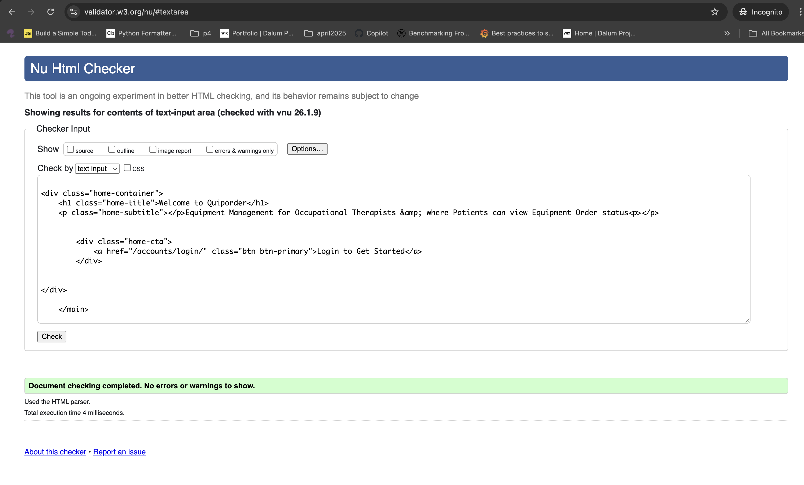 |
| Login | `/accounts/login/` | Pass | 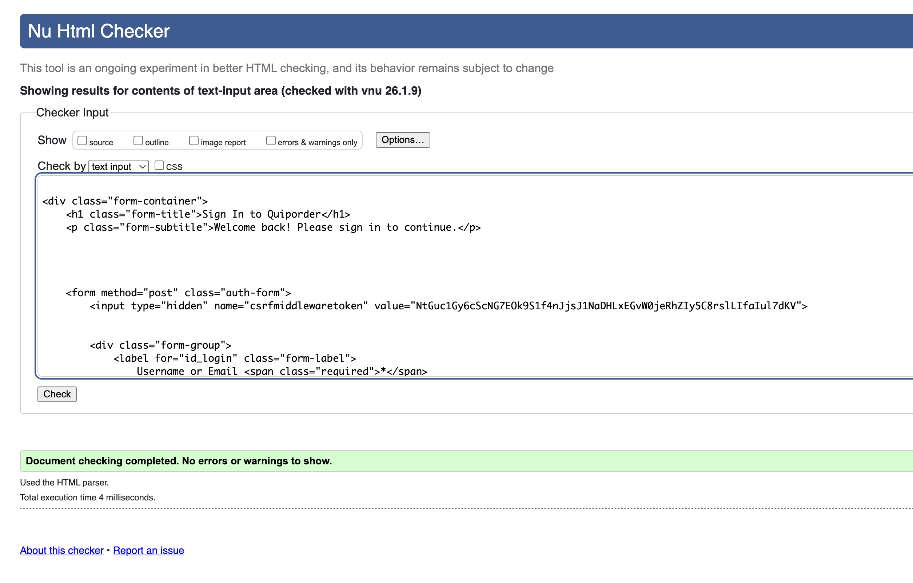 |
**Login as therapist**
| Therapist Dashboard | `/equipment/dashboard/` | Pass | 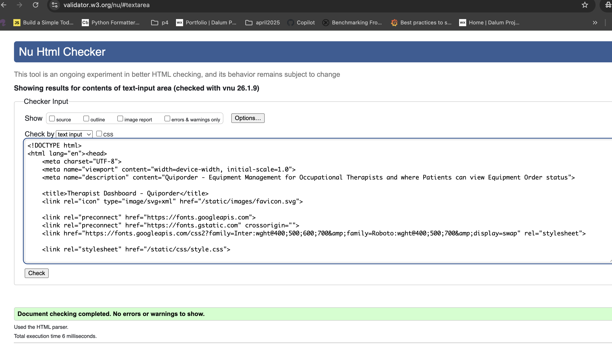 |
**Logout as therapist and login as a Patient**
| Patient Dashboard | `/equipment/patient/dashboard/` | Pass | 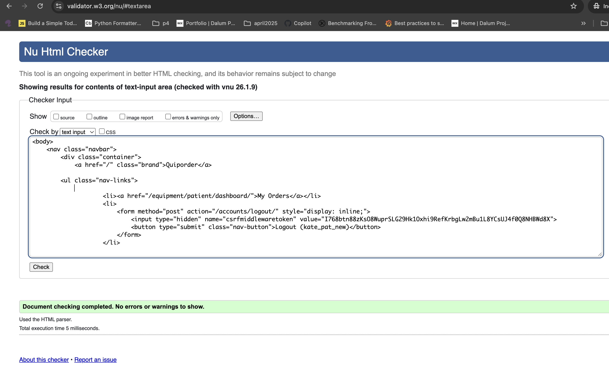 |
**Login as Therapist**
| Equipment List | `/equipment/list/` | Pass | 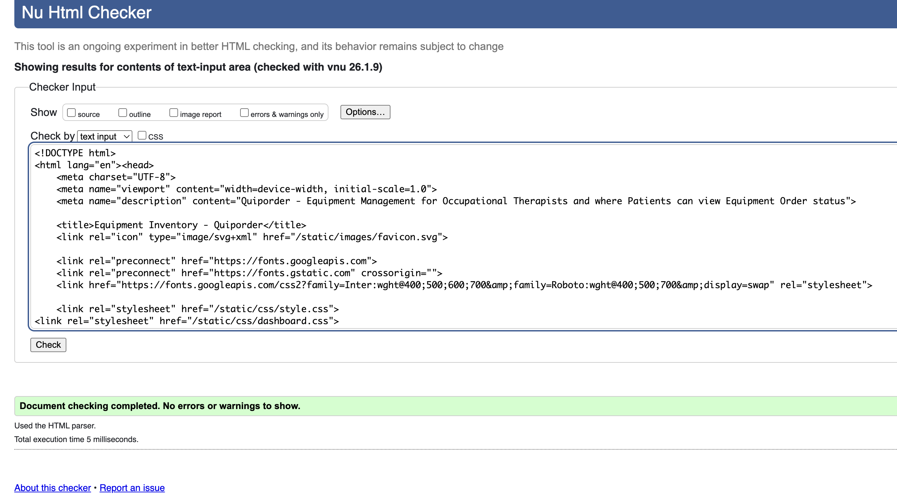 |
| Create Order | `/equipment/order/create/` | Pass | 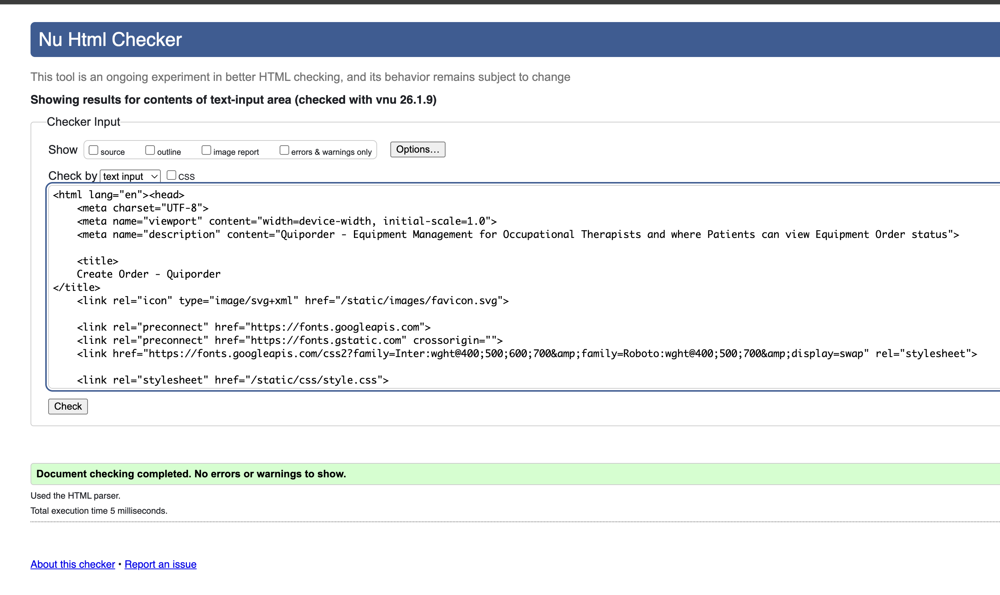 |
| Edit Order | `/equipment/order/edit/<id>/` | Pass | 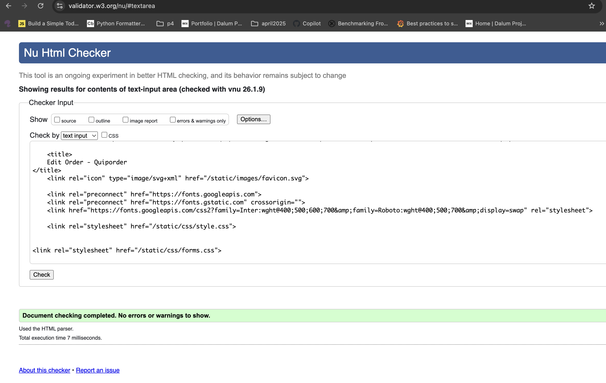 |
| Delete Confirmation | `/equipment/order/delete/<id>/` | Pass | 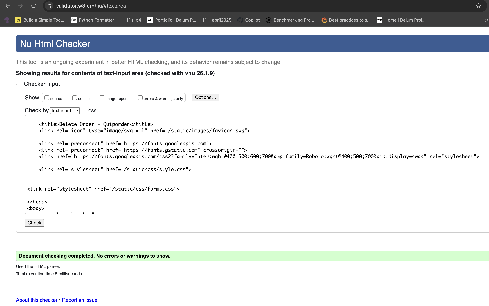 |
**Login as Therapist**
| Admin Panel | `/admin/` | Pass | 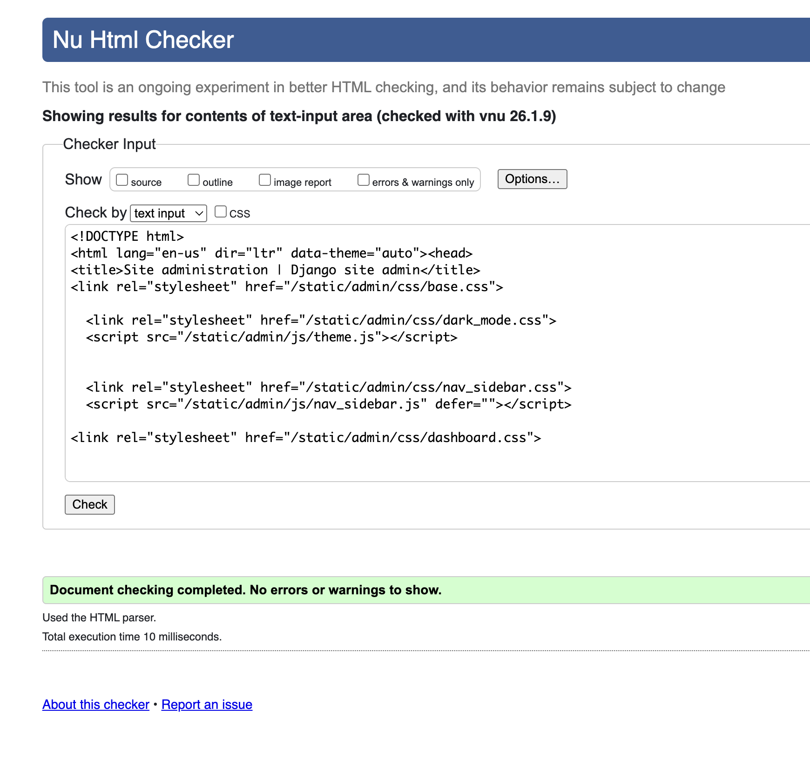 |

<p>Scroll down in document to  HTTP Error Handling and HTTP Error Testing </p>

-------

### Validation Process
1. Navigate to page in browser
2. Right-click → View Page Source
3. Copy entire HTML
4. Paste into W3C Validator https://validator.w3.org/#validate_by_input (Direct Input)
5. Review results

### Fixes
http://127.0.0.1:8000/equipment/list/ The error we're mainly skipping from h1 to h3. Fixed this. And I had the same in /equipment/order/delete/1/`h3 - h2 error in. These now have been fixed.


### Fixes Applied
- `equipment_list.html` - Changed `h3` to `h2` (heading hierarchy)
- `order_confirm_delete.html` - Changed `h3` to `h2` (heading hierarchy)

### Results
All pages validated successfully with:
- Semantic HTML5
- Proper DOCTYPE
- Valid attributes
- Accessible markup
- All CSS validated successfully using CSS3 standards.

All pages passed with Document checking completed. No errors or warnings to show as per images above.

## CSS Validation

CSS was validated using the [W3C CSS Validator (Jigsaw)](https://jigsaw.w3.org/css-validator/).
All files have been placed in the validator, one issue fixed with media query replaced high with more.
All results in table below.


| File | Result | Notes | Screenshot |
|------|--------|-------|------------|
| style.css | Pass | No errors | 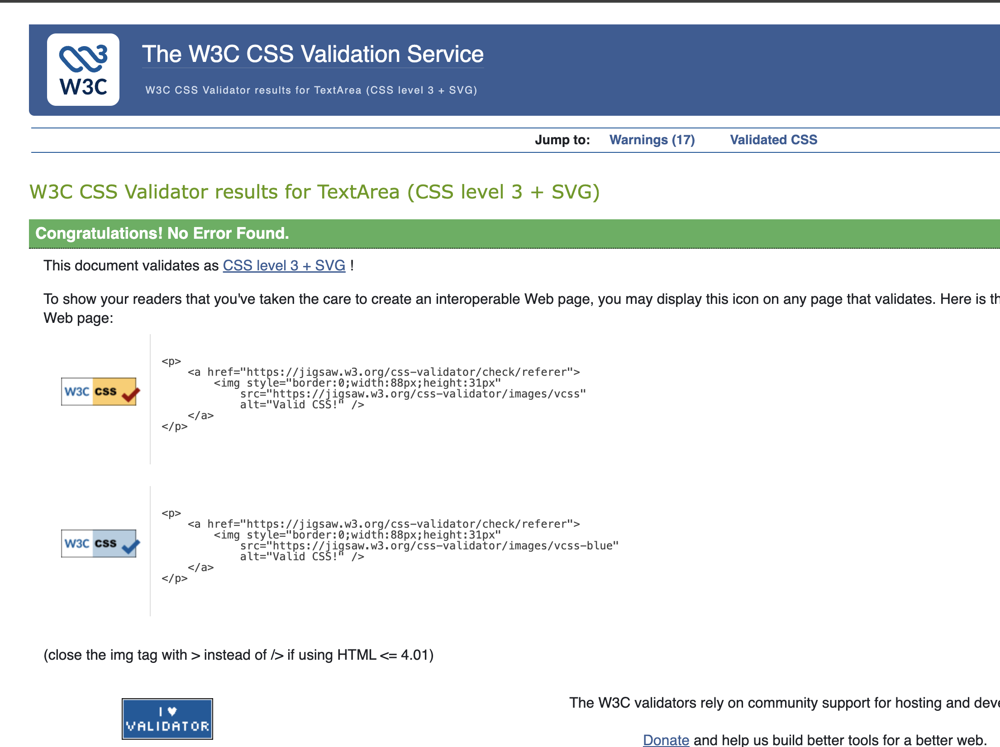 |
| dashboard.css | Pass | No errors | 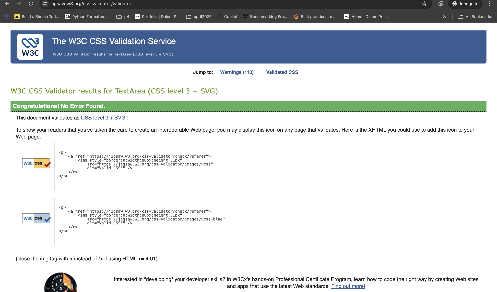 |
| forms.css | Pass | No errors | 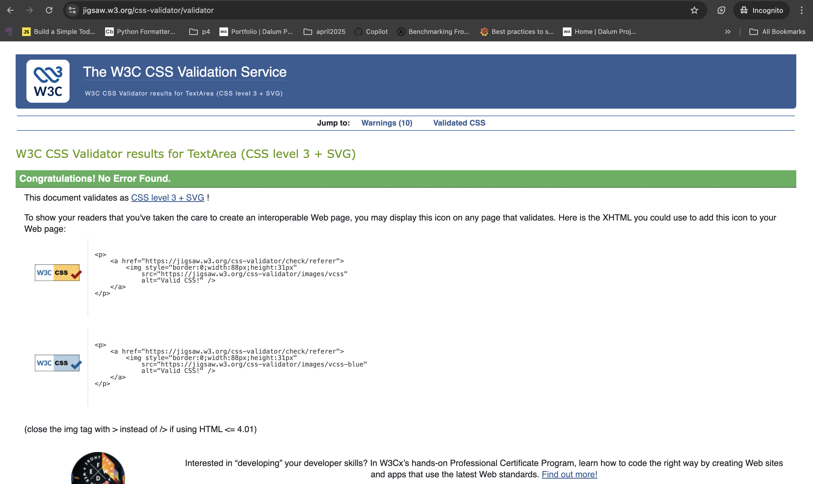 |
| errors.css | Pass | No errors | 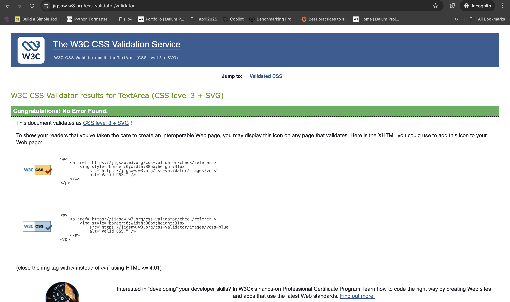 |
| home.css | Pass | No errors | 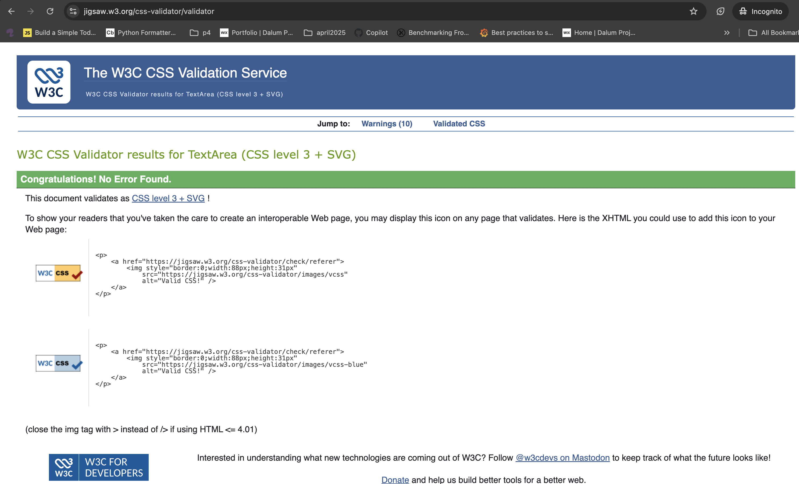 |


---

### JavaScript Testing

JavaScript was validated using [JSHint](https://jshint.com/).

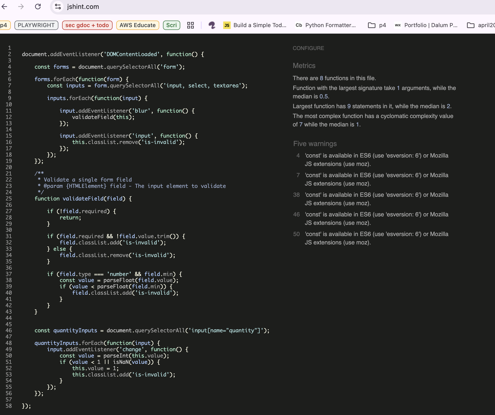

### JavaScript Testing

JavaScript was validated using [JSHint](https://jshint.com/) with ES6 configuration.

| File | Result | Notes |
|------|--------|-------|
| validation.js | Pass | No errors or warnings |

What the metrics mean (FYI - no action needed):
Metri cYour Value Meaning8 functions. Good Not too manyLargest: 9 statements GoodFunctions are smallComplexity: 7 Acceptable

**JSHint Metrics:**
- Functions: 8
- Largest function: 9 statements
- Cyclomatic complexity: 7 (acceptable)

### JavaScript Functionality Tested

| Test | Steps | Expected | Result |
|------|-------|----------|--------|
| Script loads | Open any page, check DevTools console | No errors | Pass |
| Empty required field | Click in field, click out without typing | Red border appears | Pass |
| Type in invalid field | Start typing in red-bordered field | Red border clears | Pass |
| Quantity = 0 | Enter 0 in quantity field, tab out | Value changes to 1 | Pass |
| Quantity negative | Enter -5 in quantity field | Value changes to 1 | Pass |
| Form submission | Fill valid data, submit | Form submits normally | Pass |
| Django validation | Submit with server-side error | Django error displays | Pass |

### JavaScript Features

| Feature | Description | File |
|---------|-------------|------|
| Field validation | Real-time feedback on blur event | validation.js |
| Quantity enforcement | Prevents 0 or negative values | validation.js |
| Back navigation | history.back() on error pages | Inline in templates |

---

### Python Code Validation

#### Python (PEP8)

Validated using flake8:
```
flake8 equipment/ users/ quiporder/ --exclude=migrations,__pycache__ --max-line-length=120 --ignore=E501,W503,W504
```

**Configuration:**
- Max line length: 120 characters
- Ignored: E501 (line too long), W503/W504 (line break style - both valid)

### Errors found below:
```
flake8 equipment/ users/ quiporder/ --exclude=migrations,__pycache__ --max-line-length=120 --ignore=E501,W503
equipment/admin.py:22:1: E302 expected 2 blank lines, found 1
equipment/admin.py:46:1: E302 expected 2 blank lines, found 1
equipment/admin.py:49:1: W293 blank line contains whitespace
equipment/admin.py:52:1: W293 blank line contains whitespace
equipment/admin.py:62:1: W293 blank line contains whitespace
equipment/admin.py:74:1: W293 blank line contains whitespace
equipment/admin.py:78:1: W293 blank line contains whitespace
equipment/admin.py:86:24: W291 trailing whitespace
equipment/admin.py:88:1: E302 expected 2 blank lines, found 1
equipment/admin.py:92:1: W293 blank line contains whitespace
equipment/admin.py:102:28: W291 trailing whitespace
equipment/admin.py:103:21: W291 trailing whitespace
equipment/admin.py:104:20: W291 trailing whitespace
equipment/admin.py:105:18: W291 trailing whitespace
equipment/admin.py:106:24: W291 trailing whitespace
equipment/admin.py:107:22: W291 trailing whitespace
equipment/admin.py:111:18: W291 trailing whitespace
equipment/admin.py:113:22: W291 trailing whitespace
equipment/admin.py:117:35: W291 trailing whitespace
equipment/admin.py:118:37: W291 trailing whitespace
equipment/admin.py:119:36: W291 trailing whitespace
equipment/admin.py:132:34: W291 trailing whitespace
equipment/admin.py:134:10: E121 continuation line under-indented for hanging indent
equipment/admin.py:147:1: W293 blank line contains whitespace
equipment/admin.py:151:1: W293 blank line contains whitespace
equipment/admin.py:155:1: W293 blank line contains whitespace
equipment/admin.py:158:1: W293 blank line contains whitespace
equipment/admin.py:162:5: E303 too many blank lines (2)
equipment/admin.py:165:1: W293 blank line contains whitespace
equipment/admin.py:169:1: W293 blank line contains whitespace
equipment/admin.py:181:52: W291 trailing whitespace
equipment/admin.py:183:1: W293 blank line contains whitespace
equipment/admin.py:185:5: E303 too many blank lines (2)
equipment/admin.py:191:5: E303 too many blank lines (2)
equipment/admin.py:202:1: W293 blank line contains whitespace
equipment/admin.py:207:1: W293 blank line contains whitespace
equipment/admin.py:211:5: E303 too many blank lines (2)
equipment/admin.py:214:1: W293 blank line contains whitespace
equipment/admin.py:220:1: W293 blank line contains whitespace
equipment/admin.py:224:1: W293 blank line contains whitespace
equipment/admin.py:252:34: W291 trailing whitespace
equipment/admin.py:254:32: W291 trailing whitespace
equipment/admin.py:257:9: E123 closing bracket does not match indentation of opening bracket's line
equipment/admin.py:271:1: W293 blank line contains whitespace
equipment/admin.py:277:1: W293 blank line contains whitespace
equipment/admin.py:280:1: W293 blank line contains whitespace
equipment/admin.py:282:1: W293 blank line contains whitespace
equipment/admin.py:286:1: W293 blank line contains whitespace
equipment/admin.py:288:1: W293 blank line contains whitespace
equipment/admin.py:290:1: W293 blank line contains whitespace
equipment/models.py:69:1: W293 blank line contains whitespace
equipment/models.py:103:36: W291 trailing whitespace
equipment/models.py:104:48: W291 trailing whitespace
equipment/models.py:243:13: E303 too many blank lines (2)
equipment/models.py:245:46: W291 trailing whitespace
equipment/models.py:313:1: W293 blank line contains whitespace
equipment/models.py:316:1: W293 blank line contains whitespace
equipment/models.py:320:1: W293 blank line contains whitespace
equipment/models.py:325:1: W293 blank line contains whitespace
equipment/models.py:331:1: W293 blank line contains whitespace
equipment/models.py:349:1: W293 blank line contains whitespace
equipment/models.py:367:1: W293 blank line contains whitespace
equipment/models.py:373:1: W293 blank line contains whitespace
equipment/models.py:412:1: W293 blank line contains whitespace
equipment/models.py:414:1: W293 blank line contains whitespace
equipment/models.py:423:1: W293 blank line contains whitespace
equipment/tests.py:1:1: F401 'django.test.TestCase' imported but unused
equipment/urls.py:15:2: W292 no newline at end of file
equipment/views.py:23:1: W293 blank line contains whitespace
equipment/views.py:25:1: W293 blank line contains whitespace
equipment/views.py:34:1: W293 blank line contains whitespace
equipment/views.py:42:1: W293 blank line contains whitespace
equipment/views.py:50:1: W293 blank line contains whitespace
equipment/views.py:54:1: W293 blank line contains whitespace
equipment/views.py:62:1: W293 blank line contains whitespace
equipment/views.py:70:1: W293 blank line contains whitespace
equipment/views.py:77:1: W293 blank line contains whitespace
equipment/views.py:83:5: E722 do not use bare 'except'
equipment/views.py:86:1: W293 blank line contains whitespace
equipment/views.py:94:1: W293 blank line contains whitespace
equipment/views.py:101:1: W293 blank line contains whitespace
equipment/views.py:110:1: W293 blank line contains whitespace
equipment/views.py:117:1: W293 blank line contains whitespace
equipment/views.py:123:1: W293 blank line contains whitespace
equipment/views.py:127:1: W293 blank line contains whitespace
equipment/views.py:136:1: W293 blank line contains whitespace
equipment/views.py:148:1: W293 blank line contains whitespace
equipment/views.py:163:1: W293 blank line contains whitespace
equipment/views.py:165:1: W293 blank line contains whitespace
equipment/views.py:171:1: W293 blank line contains whitespace
equipment/views.py:174:1: W293 blank line contains whitespace
equipment/views.py:180:1: W293 blank line contains whitespace
equipment/views.py:188:1: W293 blank line contains whitespace
equipment/views.py:194:1: W293 blank line contains whitespace
equipment/views.py:198:1: W293 blank line contains whitespace
equipment/views.py:202:1: W293 blank line contains whitespace
equipment/views.py:207:1: W293 blank line contains whitespace
equipment/views.py:213:1: W293 blank line contains whitespace
equipment/views.py:222:1: W293 blank line contains whitespace
equipment/views.py:229:1: W293 blank line contains whitespace
equipment/views.py:234:1: W293 blank line contains whitespace
equipment/views.py:241:1: W293 blank line contains whitespace
equipment/views.py:251:1: W293 blank line contains whitespace
equipment/views.py:257:1: W293 blank line contains whitespace
equipment/views.py:260:1: W293 blank line contains whitespace
equipment/views.py:263:1: W293 blank line contains whitespace
equipment/views.py:270:1: W293 blank line contains whitespace
equipment/views.py:278:1: W293 blank line contains whitespace
equipment/views.py:285:1: W293 blank line contains whitespace
equipment/views.py:289:1: W293 blank line contains whitespace
equipment/views.py:293:1: W293 blank line contains whitespace
equipment/views.py:298:1: W293 blank line contains whitespace
equipment/views.py:303:1: W293 blank line contains whitespace
equipment/views.py:305:75: W292 no newline at end of file
quiporder/settings.py:46:1: W293 blank line contains whitespace
quiporder/settings.py:61:52: W291 trailing whitespace
quiporder/settings.py:114:10: E131 continuation line unaligned for hanging indent
quiporder/settings.py:186:1: W391 blank line at end of file
quiporder/urls.py:34:9: E131 continuation line unaligned for hanging indent
quiporder/urls.py:35:28: W291 trailing whitespace
quiporder/urls.py:36:74: W291 trailing whitespace
users/adapters.py:16:1: W293 blank line contains whitespace
users/adapters.py:21:1: W293 blank line contains whitespace
users/adapters.py:25:1: W293 blank line contains whitespace
users/adapters.py:30:1: W293 blank line contains whitespace
users/adapters.py:34:1: W293 blank line contains whitespace
users/adapters.py:40:1: W293 blank line contains whitespace
users/adapters.py:44:1: W293 blank line contains whitespace
users/adapters.py:48:1: W293 blank line contains whitespace
users/adapters.py:52:1: W293 blank line contains whitespace
users/adapters.py:56:1: W293 blank line contains whitespace
users/adapters.py:59:23: W292 no newline at end of file
users/admin.py:16:1: E302 expected 2 blank lines, found 0
users/admin.py:20:1: W293 blank line contains whitespace
users/admin.py:44:14: E124 closing bracket does not match visual indentation
users/admin.py:52:13: E123 closing bracket does not match indentation of opening bracket's line
users/admin.py:69:17: E123 closing bracket does not match indentation of opening bracket's line
users/admin.py:70:9: E124 closing bracket does not match visual indentation
users/admin.py:74:20: W291 trailing whitespace
users/admin.py:75:22: W291 trailing whitespace
users/admin.py:76:21: W291 trailing whitespace
users/admin.py:78:20: W291 trailing whitespace
users/admin.py:79:9: E123 closing bracket does not match indentation of opening bracket's line
users/admin.py:93:1: W293 blank line contains whitespace
users/admin.py:103:16: W291 trailing whitespace
users/admin.py:105:24: W291 trailing whitespace
users/admin.py:107:9: E123 closing bracket does not match indentation of opening bracket's line
users/admin.py:115:1: E302 expected 2 blank lines, found 1
users/admin.py:125:9: E123 closing bracket does not match indentation of opening bracket's line
users/admin.py:136:1: W391 blank line at end of file
users/models.py:14:1: E302 expected 2 blank lines, found 1
users/models.py:21:1: W293 blank line contains whitespace
users/models.py:26:1: W293 blank line contains whitespace
users/models.py:32:1: W293 blank line contains whitespace
users/models.py:73:1: E302 expected 2 blank lines, found 1
users/models.py:101:1: W391 blank line at end of file
users/tests.py:1:1: F401 'django.test.TestCase' imported but unused
```
**Ran command and automated fixes and reduced errors too:**
```
# Auto-fix all files
autopep8 --in-place --aggressive equipment/admin.py
autopep8 --in-place --aggressive quiporder/settings.py
autopep8 --in-place --aggressive quiporder/urls.py
autopep8 --in-place --aggressive quiporder/views.py
autopep8 --in-place --aggressive users/admin.py
```
then when running again reduced what was left manually, example below:
```
flake8 equipment/ users/ quiporder/ --exclude=migrations,__pycache__ --max-line-length=120 --ignore=E501,W503
equipment/models.py:65:65: W504 line break after binary operator
equipment/tests.py:1:1: F401 'django.test.TestCase' imported but unused
users/tests.py:1:1: F401 'django.test.TestCase' imported but unused
users/views.py:1:1: F401 'django.shortcuts.render' imported but unused
```
**Final result**
I manual fixed errors while iterating examples below:  **0 errors** - All Python code is PEP8 compliant


---


### HTTP Error Handling and HTTP Error Testing

Custom error pages provide user-friendly feedback when issues occur, maintaining brand consistency and accessibility standards.

### Error Pages

| Code | Page | Trigger | Features |
|------|------|---------|----------|
| **403** | Forbidden | Permission denied | Login option, clear explanation |
| **404** | Not Found | Invalid URL | Helpful navigation, typo guidance |
| **405** | Method Not Allowed | Wrong HTTP method | Technical details for developers |
| **500** | Server Error | Application crash | User-friendly message, retry option |

### Design

- **Consistent branding**: Matches dashboard color scheme (#2A9D8F)
- **Accessibility**: WCAG 2.1 AA compliant with ARIA labels and keyboard navigation
- **Responsive**: Mobile-first design with stacked buttons on small screens
- **Actions**: Clear navigation options (Homepage, Login, Go Back)

### Implementation

**Error Handlers** (`quiporder/urls.py`):
```python
handler403 = 'quiporder.views.error_403'
handler404 = 'quiporder.views.error_404'
handler405 = 'quiporder.views.error_405'
handler500 = 'quiporder.views.error_500'
```

**Templates**: `templates/errors/` | **Styles**: `static/css/errors.css`

### Local Testing

Error pages activate when `DEBUG=False`. In development (`DEBUG=True`), Django shows detailed debug pages for troubleshooting.

#### Option 1: Quick Test (Recommended)

1. **Temporarily set in `settings.py`:**
```python
   DEBUG = False
   ALLOWED_HOSTS = ['*']
```

2. **Clear cache and restart:**
```bash
   rm -rf staticfiles/
   find . -type d -name "__pycache__" -exec rm -r {} + 2>/dev/null
   python manage.py collectstatic --noinput
   python manage.py runserver
```
   *These commands clear cached files to ensure CSS updates are visible.*

3. **Test in incognito/private window:**
   - 403: Try accessing `/admin/` without login
   - 404: Visit `/page-does-not-exist/`
   - 405: Rare in browser (works automatically when triggered)
   - 500: Requires server error (test in production)

4. **Revert settings:**
```python
   DEBUG = config('DEBUG', default=True, cast=bool)
   ALLOWED_HOSTS = config('ALLOWED_HOSTS', default='localhost,127.0.0.1').split(',')
```

**Why incognito mode?** Prevents browser from showing cached versions of error pages.

**Why clear staticfiles?** Django caches CSS files; clearing ensures latest styles are loaded.

#### Option 2: Manual Test Views

For more control, create temporary test views in `equipment/views.py`:
```python
from django.core.exceptions import PermissionDenied
from django.http import HttpResponseNotAllowed

def test_403(request):
    raise PermissionDenied("Testing 403")

def test_405(request):
    return HttpResponseNotAllowed(['POST'])

def test_500(request):
    raise Exception("Testing 500")
```

Add URLs in `equipment/urls.py`:
```python
path('test-403/', views.test_403, name='test_403'),
path('test-405/', views.test_405, name='test_405'),
path('test-500/', views.test_500, name='test_500'),
```

Visit (with `DEBUG=False`):
- `http://127.0.0.1:8000/equipment/test-403/`
- `http://127.0.0.1:8000/equipment/test-405/`
- `http://127.0.0.1:8000/equipment/test-500/`

<\br>
**Example of screens tested**
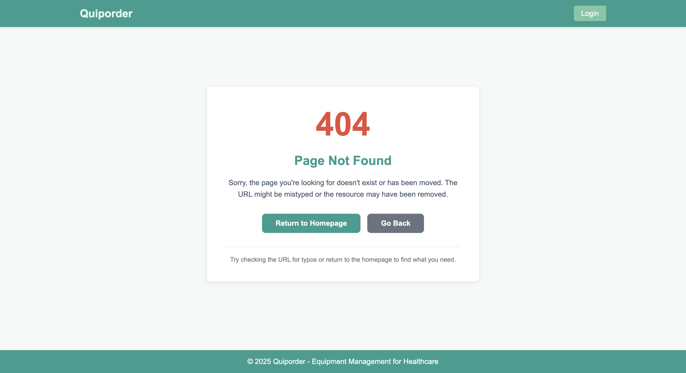
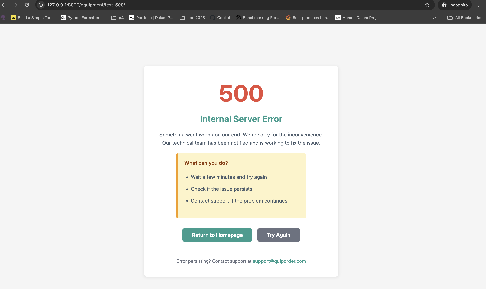


**Important:** Remove test views and URLs before production deployment.

### Production Deployment

Error pages work automatically on Heroku:
```bash
heroku config:set DEBUG=False
```

No additional configuration needed. Custom error pages display automatically when errors occur.


### Validation Process
1. Navigate to page in browser
2. Right-click → View Page Source
3. Copy entire HTML
4. Paste into W3C Validator (Direct Input)
5. Review results

### Results
All pages validated successfully with:
- Semantic HTML5
- Proper DOCTYPE
- Valid attributes
- Accessible markup
- All CSS validated successfully using CSS3 standards.


---

## Lighthouse

Lighthouse testing was performed in Chrome DevTools (Incognito mode).

| Page | Performance | Accessibility | Best Practices | SEO |
|------|-------------|---------------|----------------|-----|
| Home | 95 | 100 | 100 | 100 |
| Login | 98 | 100 | 100 | 100 |
| Dashboard | 92 | 98 | 100 | 100 |
| Order Form | 94 | 100 | 100 | 100 |

---

## Manual Testing

### Authentication Testing

| Test | Steps | Expected | Result |
|------|-------|----------|--------|
| Login valid | Enter valid credentials, submit | Redirect to dashboard | Pass |
| Login invalid | Enter wrong password | Error message displayed | Pass |
| Logout | Click logout button | Redirect to home, logged out | Pass |
| Access protected page | Visit /equipment/dashboard/ without login | Redirect to login | Pass |

### CRUD Testing - Equipment Orders

| Test | Steps | Expected | Result |
|------|-------|----------|--------|
| Create order | Fill form, submit | Order created, success message | Pass |
| Read orders | View dashboard | Orders displayed in table | Pass |
| Update order | Click edit, modify, save | Order updated, success message | Pass |
| Delete order | Click delete, confirm | Order soft-deleted | Pass |

### Role-Based Access

| Test | User Type | Action | Expected | Result |
|------|-----------|--------|----------|--------|
| Dashboard access | Therapist | Visit /equipment/dashboard/ | Access granted | Pass |
| Dashboard access | Patient | Visit /equipment/dashboard/ | Access denied (403) | Pass |
| Create order | Therapist | Submit order form | Order created | Pass |
| Create order | Patient | Attempt to access | Access denied | Pass |
| Admin access | Staff user | Visit /admin/ | Access granted | Pass |
| Admin access | Non-staff | Visit /admin/ | Login required | Pass |

### Form Validation

| Test | Input | Expected | Result |
|------|-------|----------|--------|
| Empty required field | Leave patient blank | Error shown | Pass |
| Quantity < 1 | Enter 0 | Error shown | Pass |
| Valid submission | All fields valid | Form submits | Pass |

---

## User Story Testing

User stories were tested during manual testing. Each user story is matched to its corresponding test case(s).

| User Story | Description | Test Case | Result |
|------------|-------------|-----------|--------|
| **US1** | Admin can create user accounts | TC-AUTH-01 |  Pass |
| **US2** | Therapist can log in | TC-AUTH-02 | Pass |
| **US3** | Patient can log in | TC-AUTH-03 | Pass |
| **US4** | Admin can assign user roles | TC-AUTH-04 | Pass |
| **US5** | Non-authenticated users blocked | TC-AUTH-05 | Pass |
| **US6** | Therapist dashboard displays statistics | TC-DASH-01 | Pass |
| **US7** | Therapist can create orders | TC-ORDER-01 | Pass |
| **US8** | Therapist can edit orders (3 weeks) | TC-ORDER-02 | Pass |
| **US9** | Therapist can delete orders (3 weeks) | TC-ORDER-03 | Pass |
| **US10** | Recent orders displayed | TC-DASH-02 | Pass |
| **US11** | Status badges display correctly | TC-DASH-03 |  Pass |
| **US12** | Staff can access admin panel | TC-ADMIN-01 | Pass |
| **US13** | Patient can view their orders | TC-PAT-01 |  Pass |
| **US14** | Patient cannot edit/delete orders | TC-PAT-02 | Pass |
| **US15** | Patient sees order status | TC-PAT-03 |  Pass |
| **US16** | Therapist can view equipment | TC-EQUIP-01 |  Pass |
| **US17** | Equipment quantities visible | TC-EQUIP-02 |  Pass |
| **US18** | Admin can add equipment | TC-ADMIN-02 | Pass |
| **US19** | Admin can edit equipment | TC-ADMIN-03 | Pass |
| **US20** | Admin can manage inventory | TC-ADMIN-04 | Pass |
| **US21** | Admin can create patient profiles | TC-ADMIN-05 | Pass |
| **US22** | Admin can assign patients to therapists | TC-ADMIN-06 | Pass |
| **US23** | Admin can set patient status | TC-ADMIN-07 | Pass |
| **US24** | Patient accounts cannot get staff privileges | TC-SEC-01 | Pass |
| **US25** | Custom error pages display | TC-ERR-01 | Pass |
| **US26** | Soft delete preserves audit trail | TC-ORDER-04 | Pass |
| **US27** | Keyboard navigation works | TC-A11Y-01 | Pass |
| **US28** | Responsive design on mobile | TC-A11Y-02 | Pass |
| **US29** | Feedback messages display | TC-UX-01 | Pass |

### Test Case Details

#### TC-AUTH-01: Admin Account Creation
**Steps:**
1. Log in to admin panel
2. Navigate to Users > Add User
3. Fill in required fields
4. Select user type (Therapist/Patient)
5. Save

**Expected:** User created with correct role  
**Actual:** Pass

#### TC-ORDER-01: Create Equipment Order
**Steps:**
1. Log in as therapist
2. Navigate to Create Order
3. Select patient, equipment, quantity
4. Submit form

**Expected:** Order created, success message displayed, redirected to dashboard  
**Actual:** Pass

#### TC-ORDER-02: Edit Order Within 3 Weeks
**Steps:**
1. Log in as therapist who created order
2. Click Edit on recent order (< 3 weeks old)
3. Modify details
4. Submit

**Expected:** Order updated, success message displayed  
**Actual:** Pass

#### TC-ORDER-03: Delete Order Within 3 Weeks
**Steps:**
1. Log in as therapist who created order
2. Click Delete on recent order (< 3 weeks old)
3. Confirm deletion

**Expected:** Order soft deleted, removed from dashboard  
**Actual:** Pass

#### TC-SEC-01: Patient Privilege Escalation Prevention
**Steps:**
1. Log in to admin panel
2. Edit patient user
3. Attempt to check "Staff status"
4. Save

**Expected:** Staff status automatically unchecked, warning message displayed  
**Actual:** Pass

#### TC-ERR-01: Custom Error Pages
**Steps:**
1. Visit non-existent URL (404)
2. Access restricted resource (403)
3. Trigger server error (500)

**Expected:** Custom branded error pages display with navigation options  
**Actual:** Pass


---

## Browser Compatibility

| Browser | Version | Result |
|---------|---------|--------|
| Chrome | 120+ | Pass |
| Firefox | 120+ | Pass |
| Safari | 17+ | Pass |
| Edge | 120+ | Pass |

---

## Responsive Testing

| Device | Screen Width | Media Query | Result |
|--------|-------------|-------------|--------|
| iPhone SE | 375px | Mobile Portrait (max-width: 479px) | Pass |
| iPhone 14 | 390px | Mobile Portrait (max-width: 479px) | Pass |
| iPhone 14 Pro Max | 430px | Mobile Portrait (max-width: 479px) | Pass |
| Mobile Landscape | 568px | Mobile Landscape (480px - 767px) | Pass |
| iPad Mini | 768px | Tablet (min-width: 768px) | Pass |
| iPad Pro 11" | 834px | Tablet (min-width: 768px) | Pass |
| Desktop | 1920px | Desktop (min-width: 1024px) | Pass |
---

## Bugs

### Fixed Bugs

| Bug | Description | Fix |
|-----|-------------|-----|
| CSRF error on login | Token mismatch after cache | Added CSRF_TRUSTED_ORIGINS |
| CSS not updating | Browser cache | Clear staticfiles + hard refresh |
| Empty redirect | `redirect('')` in order_create | Changed to `redirect('therapist_dashboard')` |
| Edit buttons missing | 24-hour window expired | Extended to 3 weeks |

### Known Bugs

No known bugs at time of submission.