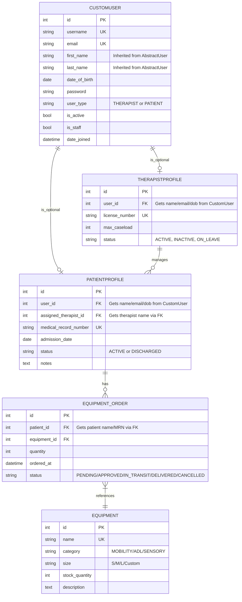

```mermaid
erDiagram
    CUSTOMUSER ||--o| THERAPISTPROFILE : is_optional
    CUSTOMUSER ||--o| PATIENTPROFILE : is_optional
    THERAPISTPROFILE ||--o{ PATIENTPROFILE : manages
    PATIENTPROFILE ||--o{ EQUIPMENT_ORDER : has
    EQUIPMENT_ORDER }|--|| EQUIPMENT : references

    CUSTOMUSER {
        int id PK
        string username UK
        string email UK
        string first_name "Inherited from AbstractUser"
        string last_name "Inherited from AbstractUser"
        date date_of_birth 
        string password
        string user_type "THERAPIST or PATIENT"
        bool is_active
        bool is_staff
        datetime date_joined
    }

    THERAPISTPROFILE {
        int id PK
        int user_id FK "Gets name/email/dob from CustomUser"
        string license_number UK
        int max_caseload
        string status "ACTIVE, INACTIVE, ON_LEAVE"
    }

    PATIENTPROFILE {
        int id PK
        int user_id FK "Gets name/email/dob from CustomUser"
        int assigned_therapist_id FK "Gets therapist name via FK"
        string medical_record_number UK
        date admission_date
        string status "ACTIVE or DISCHARGED"
        text notes
    }

    EQUIPMENT_ORDER {
        int id PK
        int patient_id FK "Gets patient name/MRN via FK"
        int equipment_id FK
        int quantity
        datetime ordered_at
        string status "PENDING/APPROVED/IN_TRANSIT/DELIVERED/CANCELLED"
    }

    EQUIPMENT {
        int id PK
        string name UK
        string category "MOBILITY/ADL/SENSORY"
        string size "S/M/L/Custom"
        int stock_quantity
        text description
    }
```
