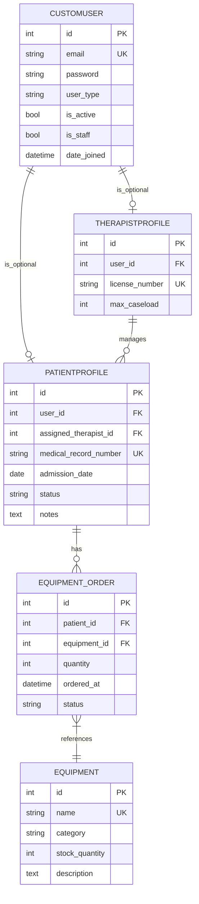

```mermaid
erDiagram
    CUSTOMUSER ||--o| THERAPISTPROFILE : is_optional
    CUSTOMUSER ||--o| PATIENTPROFILE : is_optional
    THERAPISTPROFILE ||--o{ PATIENTPROFILE : manages
    PATIENTPROFILE ||--o{ EQUIPMENT_ORDER : has
    EQUIPMENT_ORDER }|--|| EQUIPMENT : references

    CUSTOMUSER {
        int id PK
        string email UK
        string password
        string user_type
        bool is_active
        bool is_staff
        datetime date_joined
    }

    THERAPISTPROFILE {
        int id PK
        int user_id FK
        string license_number UK
        int max_caseload
    }

    PATIENTPROFILE {
        int id PK
        int user_id FK
        int assigned_therapist_id FK
        string medical_record_number UK
        date admission_date
        string status
        text notes
    }

    EQUIPMENT_ORDER {
        int id PK
        int patient_id FK
        int equipment_id FK
        int quantity
        datetime ordered_at
        string status
    }

    EQUIPMENT {
        int id PK
        string name UK
        string category
        int stock_quantity
        text description
    }
```

