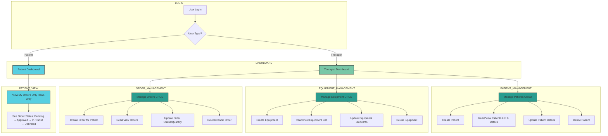

```mermaid
flowchart TD
    %% QuipOrder MVP - CRUD Flow (Layered for VS Code readability)

    %% LOGIN LAYER
    subgraph LOGIN
        A[User Login]
        A --> B{User Type?}
    end

    %% DASHBOARD LAYER
    subgraph DASHBOARD
        B -->|Therapist| C[Therapist Dashboard]
        B -->|Patient| D[Patient Dashboard]
    end

    %% THERAPIST CRUD LAYER
    subgraph PATIENT_MANAGEMENT
        C --> E[Manage Patients CRUD]
        E --> E1[Create Patient]
        E --> E2[Read/View Patients List & Details]
        E --> E3[Update Patient Details]
        E --> E4[Delete Patient]
    end

    subgraph EQUIPMENT_MANAGEMENT
        C --> F[Manage Equipment CRUD]
        F --> F1[Create Equipment]
        F --> F2[Read/View Equipment List]
        F --> F3[Update Equipment Stock/Info]
        F --> F4[Delete Equipment]
    end

    subgraph ORDER_MANAGEMENT
        C --> G[Manage Orders CRUD]
        G --> G1[Create Order for Patient]
        G --> G2[Read/View Orders]
        G --> G3[Update Order Status/Quantity]
        G --> G4[Delete/Cancel Order]
    end

    %% PATIENT LAYER
    subgraph PATIENT_VIEW
        D --> H[View My Orders Only Read-Only]
        H --> H1[See Order Status: Pending → Approved → In Transit → Delivered]
    end

    %% COLOR STYLING
    style C fill:#78C7A6,stroke:#333,stroke-width:2px
    style D fill:#56CFE1,stroke:#333,stroke-width:2px
    style E fill:#2A9D8F,stroke:#333
    style F fill:#2A9D8F,stroke:#333
    style G fill:#2A9D8F,stroke:#333
    style H fill:#56CFE1,stroke:#333
```

